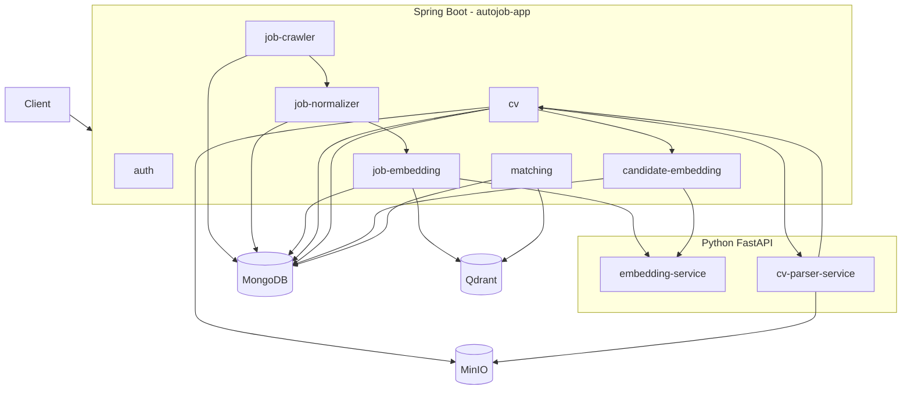

# AutoJob Matching

AutoJob là hệ thống thu thập job, chuẩn hóa dữ liệu, parse CV, tạo embedding và hybrid matching giữa candidate với job.

## Kiến trúc

Runtime hiện tại:

```text
Spring Boot Modular Monolith
+
Python FastAPI Services
+
MongoDB
+
Qdrant
+
MinIO
```

Java backend chạy trong:

```text
backend/autojob-app
```

Các domain Java được tách thành Maven module nhưng cùng chạy trong một Spring Boot application.

```text
Code như microservices,
run như modular monolith.
```

## Java modules

Runtime hiện tại gồm:

```text
common-dtos
common-events
embedding-client

job-crawler
job-normalizer
job-embedding

auth

cv
candidate-embedding

matching

autojob-app
```

`matching` hiện đã nằm trong Maven reactor và là dependency của `autojob-app`.

---

# Runtime architecture



---

# Job pipeline

Job flow:

```text
Crawler
→ raw_jobs
→ JobRawCollectedEvent
→ Job Normalizer
→ normalized_jobs
→ JobNormalizedReadyEvent
→ Job Embedding
→ embedding-service
→ job_embeddings
→ Qdrant job_vectors_v1
```

Supported parser/live crawler sources:

```text
MOCK
ITVIEC
JOBOKO
TOPDEV
VIECLAM24H
```

`MOCK` dùng local mock website.

Các source:

```text
ITVIEC
JOBOKO
TOPDEV
VIECLAM24H
```

đã có live Camel route:

```text
direct:crawl-live-itviec
direct:crawl-live-joboko
direct:crawl-live-topdev
direct:crawl-live-vieclam24h
```

Live crawler chạy tuần tự:

```text
list page
→ detail URL
→ fetch detail
→ parse
→ raw job
→ normalize
→ embedding
→ Qdrant
```

Một detail job lỗi không làm dừng toàn batch.

---

# CV pipeline

CV flow hiện đã được nối end-to-end:

```text
Upload CV
→ MinIO
→ raw_cvs
→ Java CvParsingService
→ cv-parser-service
→ CandidateProfile
→ candidate_profiles
→ CandidateProfileReadyEvent
→ candidate-embedding
→ embedding-service
→ candidate_embeddings
```

API:

```text
POST /api/cvs
POST /api/cvs/{rawCvId}/parse
GET  /api/cvs/{rawCvId}
GET  /api/cvs/{rawCvId}/profile
```

Parser version hiện tại:

```text
rule-v2
```

Candidate embedding text:

```text
candidate-text-v1
```

---

# Candidate seniority

Candidate seniority được resolve theo priority:

```text
explicit headline
→ explicit current/latest work role
→ experienceYears
→ career objective
→ target job title
```

Structured work history mạnh hơn career objective.

Ví dụ:

```text
experienceYears = 2.0
careerObjective = "Là sinh viên..."
```

với taxonomy hiện tại:

```text
seniority = MID
```

Career objective không được kéo candidate xuống `ENTRY_LEVEL`.

Các title trợ lý cũng không được infer leadership chỉ bằng substring.

Ví dụ:

```text
Trợ lý giám đốc
→ normalizedJobTitle = EXECUTIVE_ASSISTANT
→ không phải DIRECTOR
```

Trong khi:

```text
Phó giám đốc
Assistant Director
Deputy Director
→ DIRECTOR
```

Seniority taxonomy:

```text
configs/taxonomy/shared/seniority.yml
```

Parser:

```text
ai-services/cv-parser-service/app/parsing/seniority_parser.py
```

---

# Candidate embedding

Sau khi CandidateProfile được persist và `raw_cvs` chuyển thành `PARSED`:

```text
CandidateProfileReadyEvent
→ CandidateEmbeddingService
→ CandidateEmbeddingTextBuilder
→ embedding-service
→ candidate_embeddings
```

Status:

```text
PROCESSING
READY
FAILED
```

Admin API:

```text
GET  /api/admin/candidate-embeddings/{candidateProfileId}
POST /api/admin/candidate-embeddings/{candidateProfileId}/rebuild
```

---

# Matching Engine

Matching hiện đã được triển khai runtime.

Flow:

```text
CandidateProfile
+
READY candidate embedding
        |
        v
Qdrant semantic retrieval
        |
        v
hydrate normalized_jobs từ Mongo
        |
        v
hard eligibility filter
        |
        v
semantic calibration
        |
        v
hybrid scoring
        |
        v
acceptance filter
        |
        v
top results
        |
        v
match_results
```

API:

```text
POST /api/matching/candidates/{candidateProfileId}
GET  /api/matching/candidates/{candidateProfileId}
```

Có thể force rerun:

```text
POST /api/matching/candidates/{candidateProfileId}?force=true
```

Nếu:

```text
candidateEmbeddingId
+
rankingVersion
```

không đổi và `force=false`, matching reuse kết quả hiện có.

---

# Matching configuration

Source of truth:

```text
configs/matching/ranking.yml
```

Current ranking version:

```text
hybrid-v6-balanced-r4
```

Retrieval:

```text
candidate pool = 100
result limit   = 20
```

Weights:

```text
semantic   = 0.40
skill      = 0.40
seniority  = 0.10
location   = 0.05
freshness  = 0.05
```

Compatibility:

```text
normalizationVersion = rule-v4
candidateTextVersion = candidate-text-v1
jobTextVersion       = job-text-v2
```

Presentation tier:

```text
STRONG
STRETCH
POSSIBLE
EXPLORE
```

Tier chỉ phục vụ explanation/frontend.

Tier không thay:

```text
finalScore
ranking
retrieval
acceptance
```

---

# Storage

MongoDB collections chính:

```text
users
refresh_tokens

raw_jobs
normalized_jobs
job_embeddings

raw_cvs
candidate_profiles
candidate_embeddings

match_results

website_sources
source_discovery_results
```

Qdrant:

```text
job_vectors_v1
```

MinIO bucket:

```text
autojob-cvs
```

---

# Docker local development

Local flow ưu tiên Docker Compose.

Tạo env:

```powershell
Copy-Item .env.example .env
```

Khởi động:

```powershell
docker compose --env-file .env up -d --build
```

Kiểm tra:

```powershell
docker compose --env-file .env ps
```

App:

```text
http://localhost:8080
```

Embedding:

```text
http://localhost:8002
```

CV parser:

```text
http://localhost:8003
```

Qdrant:

```text
http://localhost:6333
```

MinIO:

```text
http://localhost:9000
```

MinIO Console:

```text
http://localhost:9001
```

Mock site:

```text
http://localhost:18080
```

---

# Important versions

Current expected versions:

```text
CV parser              rule-v2
Job normalization      rule-v4
Job embedding text     job-text-v2
Candidate embedding    candidate-text-v1
Matching               hybrid-v6-balanced-r4
Embedding dimension    384
Qdrant collection      job_vectors_v1
```

`.env` phải có:

```dotenv
CV_PARSER_VERSION=rule-v2
CV_PARSER_EXPECTED_VERSION=rule-v2
```

Lưu ý `docker-compose.yml` hiện vẫn có fallback `rule-v1` ở một số chỗ, vì vậy luôn chạy với:

```text
--env-file .env
```

cho tới khi fallback trong Compose được sync sang `rule-v2`.

---

# Real CV verification

Script:

```text
scripts/test-cv-parse-embedding.ps1
```

Run:

```powershell
powershell -ExecutionPolicy Bypass `
  -File .\scripts\test-cv-parse-embedding.ps1
```

Script verify:

```text
CV upload
→ parser
→ candidate profile
→ Mongo candidate_profiles
→ candidate embedding
→ Mongo candidate_embeddings
```

Matching quality hiện còn được validation bằng CV thật + data job thật trong Mongo/Qdrant bên cạnh automated tests.

---

# Documentation

```text
docs/01-architecture.md
docs/02-local-development.md
docs/04-cv-pipeline.md
docs/05-matching-engine.md
docs/06-api-reference.md
docs/07-data-storage.md
docs/08-testing-and-verification.md
docs/09-troubleshooting.md
docs/10-roadmap.md
```