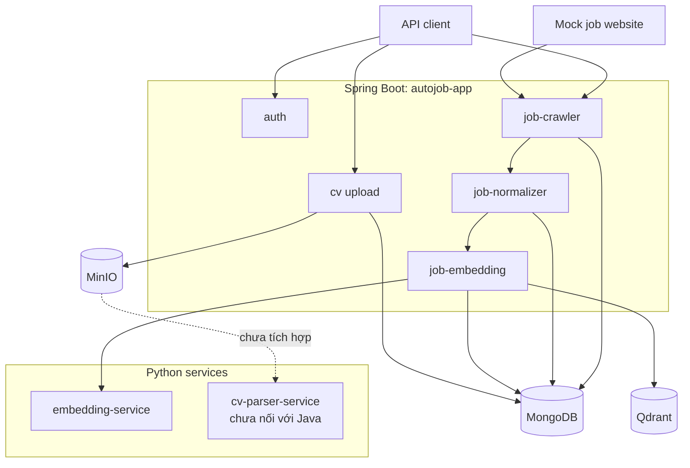
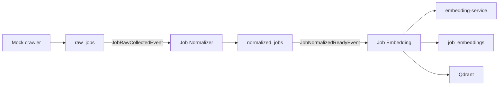
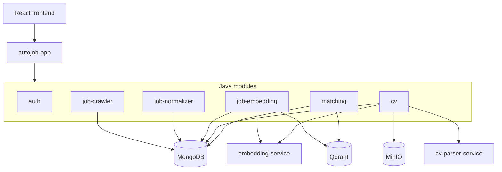

# Kiến trúc hệ thống

## Tổng quan

AutoJob sử dụng kiến trúc kết hợp:

```text
Spring Boot Modular Monolith
+
Python FastAPI Services
+
MongoDB
+
Qdrant
+
MinIO
```

Java backend chạy bằng một application duy nhất:

```text
backend/autojob-app
```

Các domain được đặt trong Maven module riêng. Cách tổ chức này giữ được boundary gần giống microservices nhưng vẫn tránh chi phí vận hành và giao tiếp phân tán khi sản phẩm còn ở giai đoạn đầu.

```text
Code như microservices, chạy như modular monolith.
```

## Vì sao dùng Modular Monolith

Các module Java được compile và chạy trong cùng JVM nhưng không nên chia sẻ logic nghiệp vụ tùy tiện.

Mỗi module chịu trách nhiệm cho một bounded context:

```text
job-crawler      → thu thập job thô
job-normalizer   → chuẩn hóa job
job-embedding    → tạo và lưu job vector
cv               → tiếp nhận và lưu CV
matching         → tìm kiếm và xếp hạng job
auth             → tài khoản và xác thực
```

Ưu điểm của cách tiếp cận hiện tại:

* Chỉ cần khởi động một Spring Boot application.
* Giao tiếp nội bộ đơn giản bằng Java method và Spring event.
* Dễ debug pipeline trên local.
* Không cần message broker cho luồng hiện tại.
* Boundary module vẫn đủ rõ để tách service sau này.

Modular Monolith không có nghĩa là tất cả module được phép truy cập trực tiếp vào implementation của nhau. Module nên giao tiếp qua event, service contract hoặc DTO có chủ đích.

## Kiến trúc runtime hiện tại



Các module đang thực sự được đưa vào runtime là:

```text
common-dtos
common-events
job-crawler
job-normalizer
job-embedding
auth
cv
autojob-app
```

Module `matching` hiện không thuộc Maven reactor trong `backend/pom.xml` và cũng không phải dependency của `autojob-app`. Vì vậy, thư mục này chưa tạo ra chức năng runtime.

## Vai trò của `autojob-app`

`autojob-app` là composition root của Java backend.

Application class:

```text
com.autojob.app.AutoJobApplication
```

Application scan toàn bộ package:

```text
com.autojob
```

Các Spring component từ những module đã được khai báo làm Maven dependency sẽ được load vào cùng application context.

`autojob-app` chịu trách nhiệm:

* Khởi động Spring Boot.
* Kết hợp các module Java.
* Bật MongoDB repositories.
* Bật scheduler.
* Load application configuration.
* Expose API của các module qua cùng một HTTP server.

Một số class trong `autojob-app/config` như `MongoConfig`, `MinioConfig`, `QdrantConfig`, `WebClientConfig` và `OpenApiConfig` hiện chỉ là placeholder. Cấu hình hoạt động thực tế đang nằm trong module tương ứng hoặc được Spring Boot auto-configure.

Ví dụ:

* MinIO client cho CV nằm trong module `cv`.
* Qdrant client nằm trong module `job-embedding`.
* MongoDB sử dụng Spring Boot configuration.
* Embedding HTTP client nằm trong module `job-embedding`.

## Boundary các Java module

### `auth`

Trạng thái: **Đã triển khai và đang được tích hợp.**

Chịu trách nhiệm:

* User registration.
* Login bằng email và password.
* BCrypt password hashing.
* JWT access token.
* Refresh token rotation.
* Logout.
* User role và account status.
* CORS.
* Request rate limiting.

MongoDB collections liên quan:

```text
users
refresh_tokens
```

Local mặc định dùng:

```text
AUTH_PUBLIC_API_MODE=true
```

Ở chế độ này, API vẫn public nhưng JWT hợp lệ vẫn được parse để lấy principal.

### `job-crawler`

Trạng thái: **Đã tích hợp cho mock crawler; external crawler mới có parser.**

Chịu trách nhiệm:

* Fetch list page và detail page.
* Parse dữ liệu cơ bản.
* Tạo fingerprint.
* Upsert `raw_jobs`.
* Cập nhật `firstSeenAt` và `lastSeenAt`.
* Publish `JobRawCollectedEvent`.

Mock crawler đang dùng Apache Camel route:

```text
direct:crawl-mock-jobs
```

Luồng hiện tại:

```text
Mock list page
→ ListPageProcessor
→ danh sách detail URL
→ DetailPageProcessor
→ RawJobService
→ raw_jobs
```

Repository có parser cho:

```text
MOCK
ITVIEC
JOBOKO
TOPDEV
VIECLAM24H
```

Tuy nhiên chỉ `MOCK` có Camel route chạy live. Các source còn lại hiện được kiểm tra chủ yếu bằng HTML fixture và parser test, chưa có route fetch website hoàn chỉnh.

### `job-normalizer`

Trạng thái: **Đã triển khai và đang được tích hợp.**

Module nhận `JobRawCollectedEvent`, load document từ `raw_jobs`, sau đó chuẩn hóa:

* Title và company text.
* Skills.
* Salary.
* Location.
* Experience.
* Seniority.
* Job type.
* Posted date và deadline.
* Apply URL và apply type.
* Nội dung dùng để embedding.

Kết quả được lưu trong:

```text
normalized_jobs
```

Logical unique key:

```text
rawJobId + normalizationVersion
```

Normalizer tính `rawContentHash` để phân biệt:

* Job thật sự thay đổi.
* Job chỉ được crawler nhìn thấy lại.
* Force re-normalization.

Khi normalized document được tạo mới hoặc thay đổi, module publish:

```text
JobNormalizedReadyEvent
```

Nếu dữ liệu không thay đổi, event embedding không được publish lại.

### `job-embedding`

Trạng thái: **Đã triển khai và đang được tích hợp.**

Module nhận `JobNormalizedReadyEvent` và thực hiện:

```text
Load normalized job
→ đọc embeddingText
→ gọi embedding-service
→ validate dimension/version/hash
→ lưu job_embeddings
→ bảo đảm Qdrant collection tồn tại
→ upsert vector
```

MongoDB collection:

```text
job_embeddings
```

Qdrant collection:

```text
job_vectors_v1
```

Payload hiện tại:

```json
{
  "jobId": "<normalizedJobId>",
  "sourceCode": "MOCK",
  "normalizationVersion": "rule-v1",
  "embeddingVersion": "...",
  "textHash": "..."
}
```

Tên field `jobId` trong Qdrant hiện chứa ID của document `normalized_jobs`.

Embedding listener bắt lỗi và không propagate lỗi về normalizer. Vì vậy:

* `normalized_jobs` vẫn có thể được lưu khi embedding service hoặc Qdrant lỗi.
* `job_embeddings` có thể mang trạng thái `FAILED`.
* Có thể rebuild embedding qua admin API sau khi dependency hoạt động lại.

### `cv`

Trạng thái: **Đã tích hợp đến bước lưu CV thô.**

Module hiện thực hiện:

```text
Multipart upload
→ validate extension và file signature
→ tính SHA-256
→ upload MinIO
→ lưu raw_cvs
```

Định dạng được chấp nhận:

```text
PDF
DOC
DOCX
```

Object key có dạng:

```text
raw/yyyy/MM/dd/{rawCvId}/{filename}
```

Nếu upload MinIO thành công nhưng ghi MongoDB thất bại, module cố gắng xóa object để tránh file mồ côi.

Module hiện chưa:

* Gọi `cv-parser-service`.
* Lưu `candidate_profiles`.
* Tạo candidate embedding.
* Trigger matching.

### `matching`

Trạng thái: **Skeleton hoặc placeholder.**

Thư mục hiện chỉ chứa Maven `pom.xml` và `.gitkeep`.

Module chưa có:

* Domain model.
* Repository.
* Qdrant search client.
* Rule-based ranking.
* `match_results`.
* API.
* Runtime integration.

Đây là phần kế hoạch, chưa được xem là chức năng đã hoạt động.

## Vai trò của Python services

### `embedding-service`

Trạng thái: **Đã được job pipeline sử dụng.**

FastAPI service expose:

```text
POST /api/v1/embeddings
GET  /health
GET  /ready
```

Service hỗ trợ hai provider:

```text
sentence-transformer
fake
```

Provider mặc định:

```text
intfloat/multilingual-e5-small
```

Response bao gồm:

* Vector.
* Dimension.
* Model name.
* Model revision.
* Embedding version.
* SHA-256 text hash.
* Trạng thái L2 normalization.

Java backend kiểm tra chặt:

* Vector có đúng dimension hay không.
* Vector có giá trị không hữu hạn hay không.
* Vector đã được L2 normalize hay chưa.
* `embeddingVersion` có khớp cấu hình hay không.
* `textHash` có khớp input hay không.

Business ranking không nằm trong service này.

### `cv-parser-service`

Trạng thái: **Có code độc lập nhưng chưa nối vào hệ thống runtime.**

Service đã có code cho:

* Đọc object từ MinIO.
* PDF extraction bằng PyMuPDF.
* DOCX extraction bằng `python-docx`.
* DOC extraction bằng `antiword`.
* Text normalization.
* Section detection.
* Contact và identity parsing.
* Skill parsing bằng taxonomy.
* Work experience parsing.
* Education, certification và language parsing.
* Experience-year calculation.
* Seniority inference.
* Parse quality và warning.

API chính:

```text
POST /api/v1/cv/parse
```

Input tham chiếu đến object trong MinIO:

```json
{
  "rawCvId": "...",
  "bucket": "autojob-cvs",
  "objectKey": "raw/...",
  "originalFilename": "candidate.pdf",
  "contentType": "application/pdf"
}
```

Tuy nhiên service hiện:

* Chưa có trong `docker-compose.yml`.
* Chưa có Java client tương ứng.
* Chưa được gọi sau CV upload.
* Chưa lưu response vào MongoDB.
* Chưa cập nhật trạng thái `raw_cvs`.

Vì vậy, CV parsing hiện là một service có implementation nhưng chưa thuộc pipeline end-to-end.

## Cách các module giao tiếp

### Spring application events

Job pipeline sử dụng event nội bộ:

```text
RawJobService
→ JobRawCollectedEvent
→ JobRawCollectedEventListener
→ JobNormalizationService
→ JobNormalizedReadyEvent
→ JobNormalizedReadyEventListener
→ JobEmbeddingService
```

Các event này:

* Chạy trong cùng JVM.
* Không được lưu bền vững.
* Không qua RabbitMQ.
* Không bảo đảm delivery nếu process dừng giữa pipeline.
* Phù hợp cho modular monolith và local MVP.

`@EventListener` mặc định chạy đồng bộ trong thread đang xử lý. Riêng embedding listener bắt exception để lỗi embedding không làm rollback kết quả normalization.

### HTTP

Java backend dùng HTTP cho:

```text
job-embedding → embedding-service
job-embedding → Qdrant REST API
```

Kế hoạch:

```text
cv module → cv-parser-service
matching module → Qdrant search API
```

### MongoDB repository

Các Java module truy cập MongoDB bằng Spring Data repositories.

MongoDB giữ:

* Dữ liệu nghiệp vụ.
* Metadata.
* Trạng thái xử lý.
* Quan hệ ID giữa các bước pipeline.

Qdrant không thay thế MongoDB.

### MinIO SDK

Module `cv` sử dụng MinIO Java SDK để lưu file.

`cv-parser-service` có MinIO Python client để đọc file, nhưng kết nối này chưa được Java backend kích hoạt.

## Vai trò của các hệ thống lưu trữ

### MongoDB

MongoDB là source of truth cho dữ liệu nghiệp vụ.

Collections đã có code sử dụng:

```text
users
refresh_tokens
raw_jobs
normalized_jobs
job_embeddings
raw_cvs
website_sources
source_discovery_results
```

Collections kế hoạch:

```text
candidate_profiles
candidate_embeddings
match_results
crawler_sources
```

### Qdrant

Qdrant dùng để tìm kiếm vector.

Hiện tại repository mới upsert job vector; chưa có candidate vector search.

Cấu hình mặc định:

```text
Collection: job_vectors_v1
Vector size: 384
Distance: Cosine
```

Qdrant chỉ giữ vector và payload tối thiểu. Thông tin job đầy đủ vẫn được load từ `normalized_jobs`.

### MinIO

MinIO lưu file CV gốc.

Bucket mặc định:

```text
autojob-cvs
```

Bucket được cấu hình private. Metadata liên kết với object được lưu trong `raw_cvs` bằng:

```text
bucket
objectKey
rawCvId
```

## Job pipeline hiện tại



Trạng thái:

```text
Mock ingestion      Đã tích hợp
Normalization       Đã tích hợp
Job embedding       Đã tích hợp
Qdrant upsert       Đã tích hợp
Live external crawl Chưa tích hợp
```

Fingerprint của `raw_jobs` là unique index. Crawler nhìn thấy cùng một job sẽ cập nhật document hiện có thay vì insert thêm document mới.

`normalized_jobs` dùng `rawContentHash` và `normalizationVersion` để kiểm soát idempotency.

`job_embeddings` dùng unique key:

```text
normalizedJobId + embeddingVersion
```

## CV pipeline hiện tại và mục tiêu

### Hiện tại

```text
Upload CV
→ validate PDF/DOC/DOCX
→ MinIO
→ raw_cvs
```

### Code đã có nhưng chưa nối

```text
raw_cvs
→ cv-parser-service
→ parsed candidate profile response
```

### Kế hoạch

```text
parsed response
→ candidate_profiles
→ candidate embeddingText
→ embedding-service
→ candidate_embeddings
→ Matching Engine
```

Không nên để Python parser ghi trực tiếp vào MongoDB. Java backend nên giữ quyền điều phối trạng thái và persistence:

```text
Java load raw_cvs
→ Java gọi parser
→ Java validate response
→ Java lưu candidate_profiles
```

Cách này giữ parser độc lập với business workflow và tránh để hai service cùng quản lý trạng thái của một collection.

## Matching Engine mục tiêu

Matching Engine chưa được triển khai.

Luồng mục tiêu:

```text
Candidate embedding
→ search topK job vectors trong Qdrant
→ lấy normalized job IDs
→ load normalized_jobs từ MongoDB
→ rule-based re-ranking
→ lưu match_results
→ trả kết quả cho frontend
```

Hybrid ranking dự kiến kết hợp:

```text
vectorScore
skillScore
seniorityScore
locationScore
freshnessScore
```

Qdrant chỉ chịu trách nhiệm candidate retrieval. Business ranking và giải thích kết quả phải nằm trong Java matching module.

Matching Engine không được:

* Match với `raw_jobs`.
* Parse lại CV.
* Parse lại raw job HTML.
* Đưa rule ranking vào embedding service.
* Dùng Qdrant payload làm dữ liệu hiển thị đầy đủ.

## Source Discovery hiện tại

Source Discovery hiện là skeleton.

Flow đang có:

```text
Create website source
→ lưu website_sources
→ sinh bốn common-path candidates
→ lưu source_discovery_results
```

Các candidate hiện được tạo theo pattern:

```text
/careers
/jobs
/tuyen-dung
/viec-lam
```

Service chưa thực hiện:

* Fetch `robots.txt`.
* Sitemap discovery.
* Scan homepage, navigation hoặc footer.
* Probe URL thật.
* ATS detection.
* Approve/reject workflow đầy đủ.
* Tạo `crawler_sources`.
* Kết nối source đã approve với Camel route.

Do đó các discovery result hiện chỉ là URL được suy đoán, không phải URL đã được xác minh.

## Kiến trúc mục tiêu



Mục tiêu vẫn là một Java application. Không cần tách Java module thành network service trước khi xuất hiện nhu cầu rõ ràng về:

* Scale độc lập.
* Ownership độc lập.
* Failure isolation.
* Queue-based workload.
* Chu kỳ release riêng.

## Nguyên tắc kiến trúc

### Raw, normalized và vector là ba lớp khác nhau

```text
raw_jobs
```

Giữ dữ liệu gần với nguồn crawler.

```text
normalized_jobs
```

Giữ dữ liệu đã chuẩn hóa để sử dụng trong business logic và hiển thị.

```text
job_vectors_v1
```

Giữ representation phục vụ semantic search.

Không dùng một lớp để thay thế lớp còn lại.

### Luôn version hóa transformation

Các bước có thể thay đổi theo thời gian:

```text
normalizationVersion
embeddingVersion
parserVersion
```

Khi rule hoặc model thay đổi, version giúp:

* Reprocess dữ liệu có kiểm soát.
* So sánh kết quả cũ và mới.
* Tránh trộn vector không tương thích.
* Xác định nguyên nhân khi ranking thay đổi.

### MongoDB là source of truth

Qdrant không giữ full job document.

Sau vector search, Matching Engine phải load dữ liệu từ MongoDB trước khi re-ranking và trả response.

### Pipeline phải idempotent

Crawler, normalizer và embedding có thể được trigger lại.

Các unique key hiện có hỗ trợ nguyên tắc này:

```text
raw_jobs:
fingerprint

normalized_jobs:
rawJobId + normalizationVersion

job_embeddings:
normalizedJobId + embeddingVersion
```

Candidate pipeline và matching pipeline sau này cũng cần logical key tương tự.

### Không thêm broker quá sớm

Luồng hiện tại sử dụng in-process events là phù hợp.

RabbitMQ chỉ nên được thêm khi cần:

* Retry có persistence.
* Background processing.
* Chống block request upload.
* Worker scale độc lập.
* Điều tiết tải parser hoặc embedding.
* Theo dõi dead-letter message.

Trước thời điểm đó, thêm broker chỉ làm tăng số thành phần cần vận hành và debug.

## Tóm tắt trạng thái kiến trúc

| Luồng                                 | Trạng thái                 |
| ------------------------------------- | -------------------------- |
| Mock source → `raw_jobs`              | Đã hoạt động               |
| `raw_jobs` → `normalized_jobs`        | Đã hoạt động               |
| `normalized_jobs` → embedding service | Đã hoạt động               |
| Job vector → Qdrant                   | Đã hoạt động               |
| CV upload → MinIO và `raw_cvs`        | Đã hoạt động               |
| Java → CV parser                      | Chưa tích hợp              |
| CV parser → `candidate_profiles`      | Chưa tích hợp              |
| Candidate embedding                   | Chưa triển khai            |
| Qdrant candidate search               | Chưa triển khai            |
| Hybrid re-ranking                     | Chưa triển khai            |
| `match_results`                       | Chưa triển khai            |
| React frontend                        | Chưa triển khai            |
| External live crawler                 | Chưa triển khai end-to-end |
| Source Discovery thực tế              | Mới là skeleton            |
