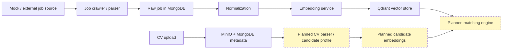

# AutoJob — AI-Powered Job Matching Platform

AutoJob is an active development platform that aims to collect job postings, normalize them into a structured format, generate embeddings for semantic search, and eventually support candidate-to-job matching with explainable recommendations. The repository currently contains the backend foundation, an embedding service, local infrastructure, and a demo-oriented job ingestion pipeline.

This repository is not yet a fully complete job-matching product. The current codebase is best understood as an early platform skeleton with working backend modules for authentication, CV upload, job ingestion, normalization, and embedding generation.

## Project status

### Implemented

- Authentication and authorization flows:
  - register
  - login
  - JWT access token issuance
  - refresh token rotation/session storage
  - logout
  - current-user endpoint
  - BCrypt password hashing
  - role support
  - rate limiting and CORS
- CV upload workflow:
  - multipart upload
  - file validation
  - SHA-256 hashing
  - metadata persistence in MongoDB
  - object storage in MinIO
  - metadata lookup by CV ID
- Job ingestion and processing pipeline:
  - raw job persistence in MongoDB
  - normalization of job fields into structured documents
  - versioned normalization output
  - embedding generation for normalized jobs
  - Qdrant vector storage
  - mock crawler and mock job site for local demo flows
- Backend and embedding-service tests.

### Partially implemented

- Live crawler reliability for external job sites.
- Job source parsing for supported sources such as ITviec, JobOKO, TopDev, and Vieclam24h; these parsers are present, but they should not be treated as production-ready without ongoing maintenance.
- Job normalization quality and taxonomy coverage.
- Embedding-service readiness and integration behavior.

### Scaffold / placeholder

- The matching module is present as a Maven module scaffold and is not yet integrated into the main application build.
- The CV parser service under ai-services/cv-parser-service is only a placeholder container/service scaffold.
- The frontend web app under frontend/web-app is not implemented.
- OpenAPI and schema artifacts under contracts/ and some configs/ are mostly placeholder or incomplete scaffolding.

### Planned

- Candidate profile extraction from CVs.
- Candidate and CV embeddings.
- Semantic CV-to-job matching.
- Explainable match scoring and reasoning.
- AI-assisted CV improvement suggestions.
- RAG-based assistant for candidate guidance.
- User-facing dashboard and recommendation experience.

## Key capabilities today

The repository already supports a local end-to-end demo flow for job ingestion and embedding:

1. A mock or external job source is parsed.
2. A raw job document is stored in MongoDB.
3. The backend normalizes the job and publishes an internal Spring application event.
4. The embedding service receives the normalized job and stores embedding metadata plus a vector in Qdrant.

The current system is a modular Spring Boot application that uses in-process Spring application events for orchestration. It is not a complete microservice architecture and does not use Kafka or another message broker.

## Architecture



## Data flow

The current job-processing pipeline is event-driven within the backend process:

1. Raw jobs are collected and stored.
2. A Spring application event, JobRawCollectedEvent, is published.
3. A normalization listener handles the event and produces a normalized job document.
4. A JobNormalizedReadyEvent is published when normalization produces a changed result.
5. An embedding listener calls the Python embedding service, stores embedding metadata in MongoDB, and writes the vector to Qdrant.

This is an internal application-event flow, not a distributed broker-based workflow.

## Technology stack

| Area | Stack |
| --- | --- |
| Backend | Java 21, Spring Boot 3.5.3, Spring Security, Spring Data MongoDB, Apache Camel, WebClient, MinIO Java SDK, Maven Wrapper |
| AI / ML | Python 3.12, FastAPI, Sentence Transformers, Hugging Face model intfloat/multilingual-e5-small, vector dimension 384, L2 normalization |
| Databases and storage | MongoDB 7, Qdrant, MinIO |
| Infrastructure | Docker Compose, mock job site, local development containers |
| Testing | JUnit 5 in backend modules, pytest in embedding service |

## Repository structure

```text
backend/          # Maven multi-module Spring Boot application
ai-services/      # Python services, including embedding-service
frontend/         # frontend workspace placeholder
contracts/        # schemas and API contract files
configs/          # normalization and ranking configuration
infra/            # infrastructure-related assets
mock-sites/       # mock job site used by local demo flows
docker-compose.yml
Makefile
README.md
```

## Prerequisites

- Docker and Docker Compose
- Java 21
- Maven or Maven Wrapper
- curl
- jq (used by the Makefile helpers)
- Python 3.12 only if you want to run the embedding service directly outside Docker

## Getting started

### 1. Configure environment

Copy the example environment file and review the defaults:

```bash
cp .env.example .env
```

The repository includes local-development defaults for MongoDB, Qdrant, MinIO, and the embedding service. Do not use these defaults in production.

### 2. Start infrastructure services

```bash
make up
```

This starts MongoDB, Qdrant, MinIO, the embedding service, and the mock job site. It does not start the Spring Boot backend automatically.

You can also run Docker Compose directly:

```bash
docker compose --env-file .env up -d
```

### 3. Start the backend

From the repository root:

```bash
cd backend
./mvnw -pl autojob-app -am spring-boot:run -Dspring-boot.run.profiles=local
```

On Windows, use:

```powershell
cd backend
mvnw.cmd -pl autojob-app -am spring-boot:run -Dspring-boot.run.profiles=local
```

### 4. Verify local services

The following local endpoints are relevant for current development:

- Backend health: http://localhost:8080/actuator/health
- Embedding health: http://localhost:8002/health
- Embedding readiness: http://localhost:8002/ready
- Qdrant HTTP: http://localhost:6333
- MinIO API: http://localhost:9000
- MinIO Console: http://localhost:9001
- Mock job website: http://localhost:18080/jobs.html
- MongoDB host port: 27018

## Run the demo pipeline

A basic demo flow is available through the mock crawler endpoint:

```bash
curl -X POST http://localhost:8080/api/admin/crawlers/mock/run
```

After the crawl completes, inspect the stored raw jobs and normalized jobs:

```bash
curl http://localhost:8080/api/raw-jobs
curl http://localhost:8080/api/normalized-jobs
```

The Makefile also exposes helper targets:

```bash
make crawl-mock
make raw-jobs
```

The mock crawl will trigger normalization and embedding flows if the backend, embedding service, and Qdrant are reachable.

## Main APIs

The backend currently exposes these API groups:

| Area | Endpoint pattern | Notes |
| --- | --- | --- |
| Authentication | /api/auth/* | register, login, refresh, logout, current user |
| CV upload | /api/cvs | upload a CV file and fetch CV metadata by ID |
| Raw jobs | /api/raw-jobs | list raw jobs and trigger normalization for a raw job |
| Normalized jobs | /api/normalized-jobs | list and fetch normalized job documents |
| Admin crawler | /api/admin/crawlers/* | run the mock crawler |
| Parser helpers | /api/parsers/* | parse local HTML fixtures for supported sources |
| Source discovery | /api/admin/source-discovery/* | create and run website-source discovery flows |
| Job embeddings | /api/job-embeddings/* and /api/admin/job-embeddings/* | inspect or rebuild embeddings for normalized jobs |

Example CV upload:

```bash
curl -X POST \
  -F "file=@./sample-cv.pdf" \
  http://localhost:8080/api/cvs
```

Use a local file that stays within the configured upload limit of 10 MB (see the CV upload settings in .env.example).

## Testing

### Backend

```bash
cd backend
./mvnw test
```

### Embedding service

```bash
cd ai-services/embedding-service
python -m venv .venv
source .venv/bin/activate
pip install -r requirements.txt
pytest -m "not model"
```

Real-model integration tests are marked with the model marker:

```bash
pytest -m model
```

These tests may download the configured sentence-transformer model on first run if it is not already cached.

## Configuration

The repository uses environment variables from .env.example. The most important ones are:

| Area | Variables | Notes |
| --- | --- | --- |
| MongoDB | MONGO_PORT, MONGO_ROOT_USERNAME, MONGO_ROOT_PASSWORD, MONGO_DATABASE | Local defaults use root/password and port 27018 |
| Qdrant | QDRANT_HTTP_PORT, QDRANT_BASE_URL, QDRANT_JOB_COLLECTION, QDRANT_VECTOR_DIMENSION | Default local endpoint is http://localhost:6333 |
| Embedding model | EMBEDDING_PROVIDER, EMBEDDING_MODEL_NAME, EMBEDDING_MODEL_REVISION, EMBEDDING_EXPECTED_DIMENSION | Defaults target the multilingual E5 small model |
| MinIO | MINIO_API_PORT, MINIO_CONSOLE_PORT, MINIO_ROOT_USER, MINIO_ROOT_PASSWORD, MINIO_BUCKET_CVS | Local defaults are intentionally simple and should be changed for any non-local deployment |
| Authentication | AUTH_PUBLIC_API_MODE, AUTH_JWT_ISSUER, JWT_SECRET_BASE64 | Local defaults set AUTH_PUBLIC_API_MODE=true. For production, disable public mode and rotate the JWT secret |
| Rate limiting | RATE_LIMIT_* | Local defaults are enabled for development and should be tuned for deployment |
| CV upload | CV_MAX_FILE_SIZE_MB, CV_MAX_FILE_SIZE, CV_MAX_REQUEST_SIZE | Current default upload limit is 10 MB |

## Roadmap

### Semantic job matching

- Parse candidate CVs into a structured profile.
- Generate candidate embeddings.
- Combine semantic similarity with structured filters such as skills, location, and experience.
- Rank job recommendations and store score components.
- Explain why a job is or is not a good match.

### AI-assisted CV improvement

- Compare a CV against a specific job description.
- Identify missing skills, weak evidence, and keyword gaps.
- Suggest improvements to summaries and bullet points.
- Keep all suggestions grounded in the user-provided evidence; do not fabricate experience or achievements.
- Require user review before any change is accepted.

### RAG chatbot

- Support questions such as:
  - Why does this job match me?
  - What skills am I missing?
  - Which experience should I highlight?
  - How should I prepare for this role?
- Ground responses in indexed CV, profile, and job data.
- Show cited evidence or source excerpts whenever possible.
- Limit hallucination and avoid making unsupported claims.

### Product layer

- Candidate dashboard.
- Job recommendations.
- Match explanations.
- Saved jobs.
- CV versions.
- Chat interface.

## Known limitations

- The matching module is not implemented yet.
- CV parsing and candidate-profile extraction are not implemented yet.
- The frontend is not implemented yet.
- Docker Compose runs the infrastructure services, but not the Spring Boot backend.
- Live job sites may change their HTML structure or deploy anti-bot controls; the mock crawler is the most stable local demo path.
- Some contract and configuration files remain incomplete or placeholder-like.
- Local security defaults are suitable only for development and are not appropriate for production.

## Responsible AI and privacy

CVs may contain sensitive personal information. In production, use access control, encryption, retention policies, and deletion workflows. AI suggestions should support the user without inventing experience or credentials. Match scores should be treated as decision support rather than a final recruitment decision.

