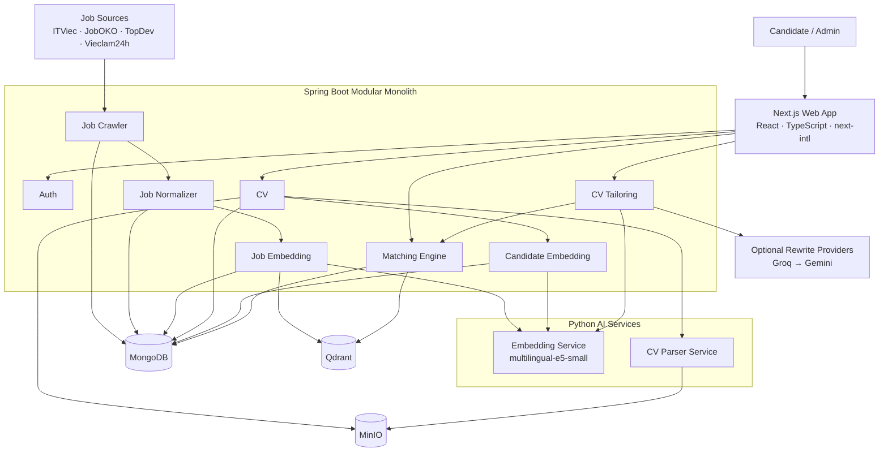

<div align="center">

# AutoJob

### Intelligent Job Matching & Evidence-Grounded CV Tailoring Platform

AutoJob transforms raw job postings and candidate CVs into structured, versioned profiles, retrieves semantically relevant opportunities, ranks them with an explainable hybrid matching engine, and helps candidates tailor their CV without fabricating experience.

<br />


**Full-stack MVP · Active development**

</div>

---

## Overview

AutoJob is a full-stack job matching platform built around four connected pipelines:

```text
Job Sources
    ↓
Crawl → Normalize → Embed → Vector Index
                            ↓
CV → Parse → Candidate Profile → Embed
                            ↓
                Hybrid Job Matching
                            ↓
              Explainable Match Results
                            ↓
             Evidence-Grounded CV Tailoring
```

Rather than treating job matching as a single opaque AI call, AutoJob separates the problem into explicit, versioned stages:

* deterministic job normalization;
* structured CV parsing;
* multilingual semantic retrieval;
* skill, seniority, location and freshness scoring;
* compatibility and acceptance gates;
* explainable ranking;
* evidence-constrained AI-assisted CV rewriting.

The Java domain is organized as independent Maven modules but composed into one Spring Boot runtime. Python services own specialized parsing and embedding workloads, while the Java application remains responsible for business orchestration and persistence.

> **Development status**
>
> The complete job → CV → embedding → matching → CV-tailoring flow exists in the current codebase. The project is still under active development and should not be considered production-ready without replacing local credentials, hardening external crawlers, adding production observability, and completing deployment-specific security configuration.

---

## Table of Contents

* [Key Capabilities](#key-capabilities)
* [Architecture](#architecture)
* [Technology Stack](#technology-stack)
* [Repository Structure](#repository-structure)
* [Core Pipelines](#core-pipelines)
* [Matching Engine](#matching-engine)
* [CV Tailoring](#cv-tailoring)
* [Authentication & Security](#authentication--security)
* [Quick Start](#quick-start)
* [Local Services](#local-services)
* [Configuration](#configuration)
* [API Overview](#api-overview)
* [Data Storage](#data-storage)
* [Version Compatibility](#version-compatibility)
* [Testing](#testing)
* [Current Limitations](#current-limitations)
* [Roadmap](#roadmap)
* [Documentation](#documentation)

---

# Key Capabilities

### Full-stack candidate experience

The Next.js web application currently provides:

* responsive landing experience;
* registration and login;
* automatic access-token refresh;
* Vietnamese and English localization;
* job browsing and job detail views;
* CV upload and parsed candidate profile visualization;
* job matching results;
* score explanations, matched skills and missing skills;
* CV tailoring analysis and before/after preview;
* role-aware user and administrator experiences.

Frontend routes include:

```text
/
├── /login
├── /register
├── /jobs
├── /cv
├── /matches
└── /admin
```

Localized routing is provided through:

```text
vi
en
```

with Vietnamese as the default locale.

---

### Multi-source job ingestion

Supported crawler sources:

```text
MOCK
ITVIEC
JOBOKO
TOPDEV
VIECLAM24H
```

The local `MOCK` source provides a deterministic crawler fixture while live sources use dedicated Apache Camel routes.

Jobs move through a versioned processing pipeline:

```text
crawl
→ raw job
→ normalize
→ generate embedding text
→ embed
→ persist metadata
→ index vector in Qdrant
```

---

### Structured CV parsing

Supported upload formats:

```text
PDF
DOC
DOCX
```

Default maximum upload size:

```text
10 MB
```

The CV parser extracts and structures information including:

```text
identity & contact
professional summary
skills
work experience
projects
education
certifications
licenses
languages
experience years
seniority
parse warnings
parse quality
```

Original files are stored privately in MinIO.

---

### Explainable hybrid matching

Semantic similarity is only one component of the ranking system.

Current scoring signals:

| Signal              | Weight |
| ------------------- | -----: |
| Semantic relevance  |    40% |
| Skill compatibility |    40% |
| Seniority           |    10% |
| Location            |     5% |
| Freshness           |     5% |

The engine also exposes:

```text
matchedSkills
missingSkills
matchTier
score breakdown
human-readable explanations
version metadata
```

---

### Evidence-grounded CV tailoring

CV tailoring combines deterministic rules with optional AI rewriting.

The system can produce:

```text
REWRITE
EMPHASIZE
GAP_WARNING
```

AI-generated rewrites are constrained by candidate evidence. The model is explicitly instructed not to invent:

```text
skills
technologies
experience
projects
achievements
metrics
dates
titles
seniority
certifications
degrees
languages
responsibilities
impact
```

Generated output is validated again by backend safety rules before being exposed to the user.

A preview can temporarily apply selected suggestions, generate a new candidate embedding, rerun matching evaluation, and compare:

```text
BEFORE
vs
AFTER
```

without modifying the persisted candidate profile.

---

# Architecture



## Architectural model

The Java backend follows a **modular monolith** architecture.

```text
Explicit module boundaries
        +
single deployable application
        =
low distributed-system overhead
while preserving domain separation
```

Domain modules communicate through Spring application events where appropriate.

Current internal job flow:

```text
JobRawCollectedEvent
        ↓
Job Normalizer
        ↓
JobNormalizedReadyEvent
        ↓
Job Embedding
```

Current candidate flow:

```text
CandidateProfileReadyEvent
        ↓
Candidate Embedding
```

These events are currently synchronous Spring events.

The system intentionally does **not** require Kafka or RabbitMQ for the current MVP architecture.

---

# Technology Stack

## Frontend

| Technology       | Purpose                           |
| ---------------- | --------------------------------- |
| Next.js 16.3     | Application framework             |
| React 19.2       | UI                                |
| TypeScript 5     | Type safety                       |
| Tailwind CSS 4   | Styling                           |
| TanStack Query 5 | Server-state management           |
| Axios            | HTTP client                       |
| next-intl        | Vietnamese / English localization |
| Zustand          | Client state utilities            |

The frontend runs on:

```text
http://localhost:5173
```

---

## Backend

| Technology               | Purpose                           |
| ------------------------ | --------------------------------- |
| Java 21                  | Runtime                           |
| Spring Boot 3.5          | Application framework             |
| Spring Security          | JWT authentication and RBAC       |
| Spring Data MongoDB      | Persistence                       |
| Apache Camel 4.10        | Crawler integration routes        |
| WebClient / HTTP clients | Internal AI service communication |
| Maven                    | Multi-module build                |
| MinIO Java SDK           | CV object storage                 |
| Jsoup                    | HTML parsing                      |

Backend runtime:

```text
backend/autojob-app
```

---

## AI Services

| Service             | Technology                                 | Responsibility                       |
| ------------------- | ------------------------------------------ | ------------------------------------ |
| `embedding-service` | FastAPI + Sentence Transformers            | Generate normalized semantic vectors |
| `cv-parser-service` | FastAPI + PyMuPDF + python-docx + antiword | Extract and structure CV content     |

Embedding model:

```text
intfloat/multilingual-e5-small
```

Current vector dimension:

```text
384
```

Current normalization:

```text
L2
```

---

## Infrastructure

```text
MongoDB 7
Qdrant
MinIO
Docker Compose
Nginx mock job site
```

---

# Repository Structure

```text
.
├── frontend/
│   └── web-app/
│       ├── src/app/                 # Next.js App Router
│       ├── src/components/          # Feature and UI components
│       ├── src/hooks/               # React Query feature hooks
│       ├── src/services/            # Backend API clients
│       ├── src/lib/                 # Auth/API/access-control utilities
│       ├── src/types/               # Frontend contracts
│       ├── src/i18n/                # Localized routing
│       └── messages/                # vi / en translations
│
├── backend/
│   ├── autojob-app/                 # Spring Boot composition root
│   │
│   ├── common/
│   │   ├── common-dtos/
│   │   ├── common-events/
│   │   └── embedding-client/
│   │
│   └── modules/
│       ├── auth/
│       ├── job-crawler/
│       ├── job-normalizer/
│       ├── job-embedding/
│       ├── cv/
│       ├── candidate-embedding/
│       ├── matching/
│       └── cv-tailoring/
│
├── ai-services/
│   ├── embedding-service/
│   └── cv-parser-service/
│
├── configs/
│   ├── crawler/
│   ├── matching/
│   └── taxonomy/
│       ├── shared/
│       ├── job-normalizer/
│       └── cv-parser/
│
├── contracts/
│   ├── events/
│   ├── openapi/
│   └── schemas/
│
├── docs/
├── infra/
├── mock-sites/
├── scripts/
├── docker-compose.yml
├── .env.example
└── README.md
```

## Backend modules

| Module                | Responsibility                                                             |
| --------------------- | -------------------------------------------------------------------------- |
| `auth`                | Registration, login, JWT, refresh-token rotation, authorization            |
| `job-crawler`         | Mock/live crawling, parsing, raw-job persistence, source discovery         |
| `job-normalizer`      | Canonical skills, location, salary, experience, seniority and job metadata |
| `job-embedding`       | Job embedding generation and Qdrant synchronization                        |
| `cv`                  | CV upload, MinIO storage, parser integration and candidate profiles        |
| `candidate-embedding` | Candidate embedding text and vector lifecycle                              |
| `matching`            | Semantic retrieval, hybrid ranking, filtering and persisted results        |
| `cv-tailoring`        | Evidence analysis, suggestions, AI rewrite safety and before/after preview |
| `embedding-client`    | Shared Java client for the embedding service                               |

---

# Core Pipelines

## 1. Job pipeline

```text
External Job Site
        ↓
Apache Camel crawler
        ↓
RawJob
        ↓
MongoDB: raw_jobs
        ↓
JobRawCollectedEvent
        ↓
JobNormalizationService
        ↓
MongoDB: normalized_jobs
        ↓
JobNormalizedReadyEvent
        ↓
JobEmbeddingService
        ↓
embedding-service
        ↓
MongoDB: job_embeddings
        +
Qdrant: job_vectors_v1
```

The crawler, normalizer and embedding stages are separated so each representation can be independently versioned and rebuilt.

A failed detail page does not need to invalidate every successfully collected job in the same crawl batch.

---

## 2. CV pipeline

```text
CV Upload
    ↓
validation
    ↓
MinIO
    +
MongoDB: raw_cvs
    ↓
CV Parser Service
    ↓
structured CandidateProfile
    ↓
MongoDB: candidate_profiles
    ↓
CandidateProfileReadyEvent
    ↓
Candidate Embedding
    ↓
embedding-service
    ↓
MongoDB: candidate_embeddings
```

Processing states include:

```text
raw_cvs
UPLOADED
PARSING
PARSED
FAILED
```

and:

```text
candidate_embeddings
PROCESSING
READY
FAILED
```

Candidate profile persistence and candidate embedding are intentionally separate.

A candidate profile can therefore remain valid even if embedding generation fails and needs to be retried.

---

## 3. Matching pipeline

```text
CandidateProfile
        +
READY CandidateEmbedding
        ↓
Qdrant semantic retrieval
        ↓
hydrate normalized jobs from MongoDB
        ↓
hard eligibility filtering
        ↓
semantic calibration
        ↓
hybrid component scoring
        ↓
acceptance filtering
        ↓
rank + limit
        ↓
MongoDB: match_results
```

Matching does not silently parse CVs or build missing candidate embeddings.

Upstream data must satisfy the required compatibility contract first.

---

## 4. CV tailoring pipeline

```text
Current candidate profile
        +
Current matching result
        +
Target normalized job
        ↓
Candidate evidence catalog
        ↓
Rule-based EMPHASIZE / GAP_WARNING
        +
Optional AI REWRITE
        ↓
backend suggestion validation
        ↓
evidence & safety guard
        ↓
user-selected suggestions
        ↓
temporary candidate profile
        ↓
temporary embedding
        ↓
matching re-evaluation
        ↓
BEFORE vs AFTER preview
```

The original persisted profile is not modified by the preview flow.

---

# Matching Engine

The matching system combines semantic retrieval with structured compatibility instead of treating cosine similarity as a final match percentage.

## Current ranking configuration

Source of truth:

```text
configs/matching/ranking.yml
```

Current ranking version:

```text
hybrid-v6-balanced-r7
```

Retrieval window:

```text
candidate pool = 100
result limit   = 20
```

Current weights:

```text
semantic   = 0.40
skill      = 0.40
seniority  = 0.10
location   = 0.05
freshness  = 0.05
```

Conceptually:

```text
final score
=
weighted known components
─────────────────────────
active component weights
```

Unknown structured information is not blindly converted into a fake neutral signal. Active weights can instead be normalized around signals for which evidence exists.

---

## Semantic retrieval

Candidate embeddings query Qdrant job vectors.

Compatibility filtering includes:

```text
normalizationVersion
embeddingVersion
job textVersion
```

The candidate and job vectors must belong to compatible embedding families.

Qdrant cosine similarity is then calibrated before being used as the semantic component of the final ranking.

---

## Skill scoring

The shared taxonomy distinguishes primary/domain skills from secondary skills.

Secondary skills such as general communication or teamwork can provide limited supporting evidence, but cannot independently make an unrelated role look like a strong professional match.

Candidate evidence confidence also depends on where the skill was found, for example:

```text
skills section
work experience
projects
profile text
other scoped evidence
```

Matching results expose:

```text
matchedSkills
missingSkills
```

---

## Seniority scoring

Candidate seniority can use:

```text
parsed candidate seniority
experience years
```

while job seniority can use:

```text
normalized seniority
minimum experience
maximum experience
```

The CV parser follows evidence priority rather than substring matching.

For example:

```text
Assistant to the Director
```

must not automatically become:

```text
DIRECTOR
```

while explicit managerial titles can legitimately map to leadership seniority.

---

## Freshness

Current ranking configuration treats:

```text
≤ 7 days
```

as fresh and rejects jobs exceeding the configured maximum age:

```text
30 days
```

when trustworthy posting-date evidence is available.

---

## Acceptance

Retrieval does not imply acceptance.

Current thresholds include:

```text
minimum final score       = 0.45
minimum semantic score    = 0.50
minimum skill score       = 0.10
strong skill score        = 0.70
strong semantic score     = 0.70
minimum structured score  = 0.10
```

This means AutoJob can return fewer than the configured result limit rather than padding the response with weak or contradictory matches.

---

## Match presentation

Current presentation tiers:

```text
STRONG
STRETCH
POSSIBLE
EXPLORE
```

These are explanation/UI tiers.

They should not be interpreted as probability estimates and do not replace the underlying ranking score.

---

# CV Tailoring

CV tailoring is designed as an evidence-constrained optimization layer on top of matching.

## Suggestion types

```text
REWRITE
```

Improves the wording of an existing CV node when supporting evidence exists.

```text
EMPHASIZE
```

Highlights relevant evidence already present in the candidate profile.

```text
GAP_WARNING
```

Identifies an important job requirement that the candidate profile does not currently support.

A gap warning is intentionally **not** converted into invented experience.

---

## AI provider strategy

AI rewriting is optional.

When configured, the provider router currently evaluates providers in runtime order:

```text
Groq
 ↓ fallback
Gemini
```

Provider failures do not have to make the entire tailoring analysis fail.

When no AI provider produces a usable rewrite, deterministic:

```text
EMPHASIZE
GAP_WARNING
```

suggestions remain available.

AI behavior can be disabled with:

```dotenv
CV_TAILORING_AI_ENABLED=false
```

---

## Rewrite safety

The AI model receives a bounded set of:

```text
editable CV nodes
allowed evidence IDs
candidate evidence
target job context
```

The backend subsequently validates returned suggestions.

Safety controls include protection against:

```text
fabricated skills
fabricated certifications
fabricated education
fabricated language proficiency
unsupported metrics
unsupported numeric claims
keyword stuffing
oversized rewrites
cross-node evidence leakage
prompt instructions embedded inside CV/JD content
```

The design principle is:

> **Improve presentation of existing evidence; never manufacture evidence to satisfy a job description.**

---

# Authentication & Security

AutoJob uses stateless JWT authentication.

Current authentication flow:

```text
Register / Login
        ↓
Access Token
+
Refresh Token
        ↓
Access token expires
        ↓
POST /api/auth/refresh
        ↓
refresh-token rotation
        ↓
retry original request
```

The frontend coordinates concurrent `401` responses so multiple failed requests can reuse the same refresh operation rather than starting independent refresh requests.

---

## Roles

Current roles:

```text
USER
ADMIN
```

New registrations receive:

```text
USER
```

The frontend uses role information for navigation and UX.

Backend Spring Security remains authoritative for access control.

---

## Passwords and tokens

Current backend security includes:

```text
BCrypt password hashing
strength = 12

JWT HS256 signing
issuer validation

short-lived access tokens
rotating refresh tokens
```

Default development TTLs:

```text
access token  = 15 minutes
refresh token = 30 days
```

---

## API authorization

Broad policy:

```text
Public
├── register
├── login
├── refresh
├── logout
└── health

USER / ADMIN
├── current user
├── normalized jobs
├── CV
├── matching
└── CV tailoring

ADMIN
├── crawler operations
├── raw jobs
├── parser utilities
├── job normalization administration
└── embedding administration
```

Unconfigured `/api/**` routes are denied by default.

---

## Rate limiting

Rate limiting is enabled by default.

Dedicated policies exist for:

```text
login
register
refresh
CV upload
general API traffic
```

Responses expose standard operational information such as:

```text
X-RateLimit-Limit
X-RateLimit-Remaining
Retry-After
```

when applicable.

---

# Quick Start

## Prerequisites

Recommended local environment:

```text
Docker
Docker Compose
Node.js + npm
```

Java and Python do not need to be installed on the host when the backend and AI services are run entirely through Docker Compose.

---

## 1. Create the local environment file

From the repository root:

### macOS / Linux

```bash
cp .env.example .env
```

### Windows PowerShell

```powershell
Copy-Item .env.example .env
```

The values in `.env.example` are intended for local development.

Do not reuse the example JWT secret, MongoDB credentials, MinIO credentials, or AI keys in production.

---

## 2. Start the backend stack

```bash
docker compose --env-file .env up -d --build
```

Inspect service status:

```bash
docker compose --env-file .env ps
```

Verify core services:

```bash
curl http://localhost:8080/actuator/health
curl http://localhost:8002/ready
curl http://localhost:8003/ready
```

The embedding container loads the configured Sentence Transformer model. Use the service health status rather than assuming it is ready immediately after container creation.

---

## 3. Configure the frontend

Create:

```text
frontend/web-app/.env.local
```

with:

```dotenv
NEXT_PUBLIC_API_BASE_URL=http://localhost:8080
```

---

## 4. Start the frontend

```bash
cd frontend/web-app

npm ci
npm run dev
```

Open:

```text
http://localhost:5173
```

The application will route through the configured locale system automatically.

---

## 5. Stop the backend stack

From the repository root:

```bash
docker compose --env-file .env down
```

To inspect logs:

```bash
docker compose --env-file .env logs -f
```

---

# Local Services

| Service           | URL / Port               | Purpose                       |
| ----------------- | ------------------------ | ----------------------------- |
| Web app           | `http://localhost:5173`  | Candidate/Admin UI            |
| AutoJob API       | `http://localhost:8080`  | Spring Boot API               |
| Embedding service | `http://localhost:8002`  | Semantic embeddings           |
| CV parser         | `http://localhost:8003`  | CV extraction and parsing     |
| MongoDB           | `localhost:27018`        | Application persistence       |
| Qdrant HTTP       | `http://localhost:6333`  | Job vector search             |
| Qdrant gRPC       | `localhost:6334`         | Qdrant gRPC                   |
| MinIO API         | `http://localhost:9000`  | CV object storage             |
| MinIO Console     | `http://localhost:9001`  | Object-storage console        |
| Mock job site     | `http://localhost:18080` | Deterministic crawler fixture |

---

# Configuration

The primary local configuration template is:

```text
.env.example
```

Important variables include:

```dotenv
# Frontend / CORS
FRONTEND_ORIGIN=http://localhost:5173

# Authentication
JWT_SECRET_BASE64=...

# Embedding
EMBEDDING_MODEL_NAME=intfloat/multilingual-e5-small
EMBEDDING_EXPECTED_DIMENSION=384

# Candidate representation
CANDIDATE_EMBEDDING_TEXT_VERSION=candidate-text-v2

# CV parser
CV_PARSER_VERSION=rule-v2
CV_PARSER_EXPECTED_VERSION=rule-v2

# Qdrant
QDRANT_JOB_COLLECTION=job_vectors_v1

# CV tailoring
CV_TAILORING_AI_ENABLED=true

GROQ_ENABLED=true
GROQ_API_KEY=

GEMINI_ENABLED=true
GEMINI_API_KEY=
```

Matching configuration is maintained separately at:

```text
configs/matching/ranking.yml
```

Shared taxonomies live under:

```text
configs/taxonomy/shared/
```

This allows normalization, CV parsing, matching and CV tailoring to share canonical concepts rather than maintaining independent hard-coded vocabularies.

---

# API Overview

Base local API:

```text
http://localhost:8080
```

## Authentication

| Method | Endpoint             |
| ------ | -------------------- |
| `POST` | `/api/auth/register` |
| `POST` | `/api/auth/login`    |
| `POST` | `/api/auth/refresh`  |
| `POST` | `/api/auth/logout`   |
| `GET`  | `/api/auth/me`       |

---

## Candidate CV

| Method | Endpoint                     | Purpose                |
| ------ | ---------------------------- | ---------------------- |
| `POST` | `/api/cvs`                   | Upload CV              |
| `GET`  | `/api/cvs/{rawCvId}`         | Read upload metadata   |
| `POST` | `/api/cvs/{rawCvId}/parse`   | Parse CV               |
| `GET`  | `/api/cvs/{rawCvId}/profile` | Read candidate profile |

Upload uses:

```text
multipart/form-data
```

with field:

```text
file
```

---

## Jobs

| Method | Endpoint                    | Purpose                   |
| ------ | --------------------------- | ------------------------- |
| `GET`  | `/api/normalized-jobs`      | Paginated normalized jobs |
| `GET`  | `/api/normalized-jobs/{id}` | Job detail                |

Common list parameters:

```text
page
size
sourceCode
normalizationVersion
```

Maximum page size:

```text
100
```

---

## Matching

| Method | Endpoint                                        | Purpose             |
| ------ | ----------------------------------------------- | ------------------- |
| `POST` | `/api/matching/candidates/{candidateProfileId}` | Run matching        |
| `GET`  | `/api/matching/candidates/{candidateProfileId}` | Read current result |

Force a fresh run:

```text
POST /api/matching/candidates/{candidateProfileId}?force=true
```

When the candidate embedding and ranking version have not changed, an existing compatible result may be reused.

---

## CV tailoring

Analyze a currently matched job:

```text
POST
/api/cv-tailoring/candidates/{candidateProfileId}/jobs/{normalizedJobId}/analyze
```

Preview selected suggestions:

```text
POST
/api/cv-tailoring/candidates/{candidateProfileId}/jobs/{normalizedJobId}/preview
```

Example preview payload:

```json
{
  "analysisId": "...",
  "acceptedSuggestionIds": [
    "..."
  ]
}
```

---

## Admin — Crawlers

Run deterministic mock crawler:

```text
POST /api/admin/crawlers/mock/run
```

Run a supported live crawler:

```text
POST /api/admin/crawlers/live/{sourceCode}/run?limit=15
```

Supported live source codes:

```text
ITVIEC
JOBOKO
TOPDEV
VIECLAM24H
```

Maximum live crawl limit:

```text
50
```

---

## Admin — Job pipeline

```text
GET  /api/raw-jobs
POST /api/raw-jobs/{rawJobId}/normalize
POST /api/admin/job-normalization/renormalize
```

---

## Admin — Embeddings

Candidate:

```text
GET  /api/admin/candidate-embeddings/{candidateProfileId}

POST /api/admin/candidate-embeddings/{candidateProfileId}/rebuild
```

Job:

```text
GET  /api/job-embeddings/{normalizedJobId}

POST /api/admin/job-embeddings/{normalizedJobId}/rebuild
```

Both rebuild endpoints support:

```text
?force=true
```

---

# Data Storage

## MongoDB

Current application collections:

```text
users
refresh_tokens

raw_jobs
normalized_jobs
job_embeddings

raw_cvs
candidate_profiles
candidate_embeddings

match_results

website_sources
source_discovery_results
```

MongoDB stores business state and metadata.

---

## Qdrant

Current job-vector collection:

```text
job_vectors_v1
```

Qdrant is used for semantic job retrieval.

Candidate vectors are persisted with candidate embedding metadata in MongoDB and are used as query vectors.

A separate candidate Qdrant collection is not required by the current architecture.

---

## MinIO

Default private bucket:

```text
autojob-cvs
```

MinIO stores original CV files.

The Python CV parser reads CV objects from MinIO, but Java remains responsible for candidate business persistence.

---

# Version Compatibility

AutoJob explicitly versions multiple representations so data generated by incompatible pipelines is not silently mixed.

Current branch configuration:

| Component                | Version                          |
| ------------------------ | -------------------------------- |
| CV parser                | `rule-v2`                        |
| Job normalization        | `rule-v4`                        |
| Job embedding text       | `job-text-v2`                    |
| Candidate embedding text | `candidate-text-v2`              |
| Matching                 | `hybrid-v6-balanced-r7`          |
| CV rewrite prompt        | `cv-rewrite-v1`                  |
| Embedding model          | `intfloat/multilingual-e5-small` |
| Embedding dimension      | `384`                            |
| Qdrant collection        | `job_vectors_v1`                 |

The matching layer verifies compatibility between candidate and job representations before ranking.

This prevents stale vectors or historical text contracts from being accidentally evaluated with a newer ranking configuration.

---

# Testing

The repository contains automated coverage across the Java modules and both Python services.

## Java backend

From:

```text
backend/
```

run:

### macOS / Linux

```bash
./mvnw test
```

### Windows

```powershell
.\mvnw.cmd test
```

Backend tests cover areas including:

```text
normalization
crawler parsing
embedding clients
candidate embedding
matching
CV processing
CV tailoring
AI provider routing
rewrite safety
```

---

## CV parser

```bash
cd ai-services/cv-parser-service

python -m pip install -r requirements-dev.txt
python -m pytest
```

Coverage includes parsing behavior for:

```text
PDF
DOC
DOCX
sections
identity/contact
skills
work experience
education
languages
seniority
shared taxonomy wiring
MinIO integration
```

---

## Embedding service

```bash
cd ai-services/embedding-service

python -m pip install -r requirements.txt
python -m pytest
```

---

## Frontend

```bash
cd frontend/web-app

npm ci
npm run lint
npm run build
```

The frontend currently exposes lint and production-build validation through its package scripts.

---

# Current Limitations

AutoJob is intentionally structured for a strong MVP while avoiding unnecessary distributed-system complexity.

Current limitations include:

```text
Frontend runs separately from the Docker Compose backend stack.

Internal Spring pipeline events are synchronous and are not backed
by a durable message broker.

Live crawlers depend on third-party website HTML and can be affected
by markup changes, redirects, rate limits or anti-bot protection.

The project does not attempt to bypass CAPTCHA, authentication walls
or third-party anti-bot controls.

Local .env.example credentials are development-only.

Production monitoring, tracing and operational dashboards are not yet
complete.

CV-tailoring AI rewrites require at least one configured provider key,
although deterministic emphasis and gap analysis can still operate
without AI rewriting.
```

---

# Roadmap

Current development priorities include:

### Matching quality

```text
larger anonymized evaluation dataset
golden regression cases
Precision@K / Recall@K / NDCG evaluation
false-positive analysis
ranking-version governance
```

### Pipeline reliability

```text
automatic embedding reconciliation
stale vector detection
batch rebuild tooling
retry/recovery workflows
```

### Crawler hardening

```text
selector monitoring
per-source failure metrics
safe scheduling
backoff
HTML-change detection
```

### Observability

```text
structured logging
pipeline correlation IDs
parse latency
embedding latency
Qdrant latency
matching latency
ranking distributions
acceptance rates
```

### Production hardening

```text
secret management
credential rotation
deployment configuration
security regression tests
durable async processing where justified
```

---

# Documentation

Additional project documentation is available under:

```text
docs/
```

Key documents:

| Document                         | Topic                     |
| -------------------------------- | ------------------------- |
| `01-architecture.md`             | System architecture       |
| `02-local-development.md`        | Local environment         |
| `04-cv-pipeline.md`              | CV ingestion and parsing  |
| `05-matching-engine.md`          | Matching design           |
| `06-api-reference.md`            | API reference             |
| `07-data-storage.md`             | MongoDB, Qdrant and MinIO |
| `08-testing-and-verification.md` | Verification strategy     |
| `09-troubleshooting.md`          | Common development issues |
| `10-roadmap.md`                  | Engineering roadmap       |

Runtime configuration and source code remain the authoritative reference for current component versions.

---

<div align="center">

### AutoJob

**Structured data. Explainable matching. Evidence-grounded CV optimization.**

</div>
