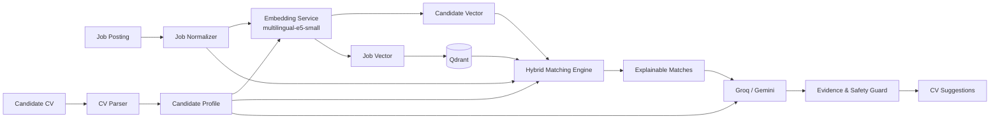

<div align="center">

# AutoJob

### AI-Powered Job Matching & Evidence-Grounded CV Tailoring Platform

AutoJob is an intelligent recruitment platform that combines **multilingual semantic embeddings, hybrid ranking, structured CV intelligence, and generative AI** to connect candidates with relevant jobs and help them optimize their CVs without fabricating experience.

<br />


**Full-stack AI application · Explainable matching · Evidence-safe generation**

</div>

---

## Why AutoJob?

Traditional job platforms usually rely on keyword search, while generic AI solutions often produce opaque recommendations or rewrite CVs without strong factual constraints.

AutoJob takes a different approach.

It combines **semantic AI with deterministic domain logic**:

```text
Job Sources
    ↓
Crawling & Normalization
    ↓
AI Embeddings
    ↓
Vector Retrieval
    ↓
Hybrid Matching Engine
    ↓
Explainable Job Recommendations
    ↓
Generative AI CV Tailoring
    ↓
Evidence & Hallucination Validation
```

Candidate processing follows a parallel AI pipeline:

```text
CV
 ↓
Document Parsing
 ↓
Structured Candidate Profile
 ↓
AI Embedding
 ↓
Semantic Retrieval
 ↓
Hybrid Ranking
 ↓
LLM-assisted CV Optimization
```

The system is intentionally designed so that **AI assists decision-making instead of replacing application logic**.

Semantic models handle meaning and retrieval, deterministic scoring handles structured compatibility, and generative models are constrained to evidence already present in the candidate's CV.

---

## AI Capabilities

### 1. Multilingual Semantic Matching

AutoJob converts both jobs and candidate profiles into semantic vectors using:

```text
intfloat/multilingual-e5-small
```

with:

```text
384-dimensional embeddings
L2 normalization
```

This allows the system to understand semantic similarity beyond exact keyword overlap.

For example, related experience can still be retrieved even when a CV and job description use different wording.

Semantic search is powered by:

```text
Embedding Service
        ↓
Qdrant Vector Database
        ↓
Relevant Job Candidates
```

---

### 2. Hybrid AI Matching

AutoJob does **not** treat vector similarity as a final match score.

Instead, semantic relevance is combined with structured signals:

| Signal              | Weight |
| ------------------- | -----: |
| Semantic relevance  |    40% |
| Skill compatibility |    40% |
| Seniority           |    10% |
| Location            |     5% |
| Freshness           |     5% |

The pipeline is:

```text
Semantic Retrieval
        ↓
Compatibility Filtering
        ↓
Skill Analysis
        ↓
Seniority Analysis
        ↓
Location & Freshness
        ↓
Hybrid Ranking
```

This produces more explainable recommendations than relying exclusively on an LLM or cosine similarity.

Each result can include:

```text
matched skills
missing skills
semantic score
skill score
seniority score
location score
freshness score
match tier
explanations
```

---

### 3. AI-Powered CV Parsing

The CV pipeline converts unstructured documents into structured candidate profiles.

Supported formats:

```text
PDF
DOC
DOCX
```

The parser extracts information such as:

```text
identity
professional summary
skills
work experience
projects
education
certifications
languages
experience years
seniority
```

The structured profile is then used to generate the candidate's semantic representation.

---

### 4. Generative AI CV Tailoring

AutoJob uses LLMs to help candidates adapt their CV to a specific job.

Current providers:

```text
Groq
 ↓ fallback
Gemini
```

Generated suggestions include:

```text
REWRITE
EMPHASIZE
GAP_WARNING
```

Example flow:

```text
Candidate CV
      +
Target Job
      ↓
Evidence Extraction
      ↓
Relevant CV Nodes
      ↓
LLM Rewrite
      ↓
Backend Validation
      ↓
Safe Suggestions
```

The goal is not simply to generate a more keyword-heavy CV.

The system attempts to improve how existing experience is communicated while preserving factual accuracy.

---

### 5. Hallucination-Aware CV Generation

One of the core constraints of AutoJob is:

> **The AI may improve how candidate evidence is presented, but it must not invent new evidence.**

LLM-generated suggestions are checked against candidate evidence.

The system protects against unsupported additions such as:

```text
skills
technologies
work experience
projects
certifications
degrees
languages
job titles
dates
metrics
achievements
responsibilities
```

This creates an important distinction between AutoJob and unrestricted CV-generation tools.

```text
Generic LLM
CV + JD
  ↓
free-form generation

AutoJob
CV + JD
  ↓
candidate evidence
  ↓
bounded AI rewrite
  ↓
validation
  ↓
evidence-safe suggestion
```

---

## AI Architecture



AutoJob therefore uses AI at multiple layers:

```text
Document Intelligence
        +
Semantic Representation
        +
Vector Retrieval
        +
Hybrid Ranking
        +
Generative AI
        +
AI Safety Validation
```

instead of depending on a single black-box model.
