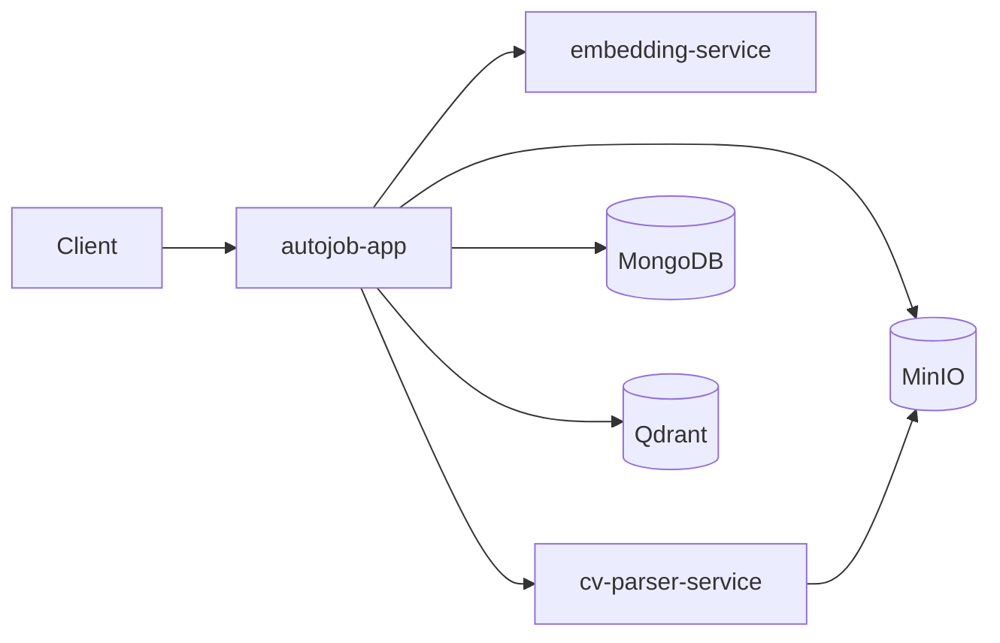

# Architecture

## 1. Tổng quan

AutoJob sử dụng:

```text
Spring Boot Modular Monolith
+
Python AI Services
+
MongoDB
+
Qdrant
+
MinIO
```

Java composition root:

```text
backend/autojob-app
```

Maven reactor hiện có:

```text
common/common-dtos
common/common-events
common/embedding-client

modules/job-crawler
modules/job-normalizer
modules/job-embedding

modules/auth

modules/cv
modules/candidate-embedding

modules/matching

autojob-app
```

---

## 2. Runtime



Python services không ghi trực tiếp candidate/job business document vào MongoDB.

Java backend giữ ownership của persistence.

---

## 3. Internal event architecture

Java modules giao tiếp bằng synchronous Spring application events.

Job:

```text
RawJobService
→ JobRawCollectedEvent
→ Job Normalizer
→ JobNormalizedReadyEvent
→ Job Embedding
```

CV:

```text
CvParsingService
→ CandidateProfileReadyEvent
→ Candidate Embedding
```

Hiện không dùng:

```text
RabbitMQ
Kafka
```

cho các flow trên.

---

## 4. Job architecture

```text
Crawler
→ raw_jobs
→ normalizer
→ normalized_jobs
→ job embedding
→ job_embeddings
→ Qdrant
```

Crawler live:

```text
MOCK
ITVIEC
JOBOKO
TOPDEV
VIECLAM24H
```

External live crawler có một Camel route cho mỗi source.

---

## 5. CV architecture

```text
POST /api/cvs
→ validate
→ MinIO
→ raw_cvs
```

Sau đó:

```text
POST /api/cvs/{rawCvId}/parse
→ CvParsingService
→ CvParserClient
→ cv-parser-service
→ MinIO
→ parsed response
→ candidate_profiles
→ raw_cvs.status = PARSED
→ CandidateProfileReadyEvent
```

Downstream:

```text
CandidateProfileReadyEvent
→ CandidateEmbeddingService
→ embedding-service
→ candidate_embeddings
```

---

## 6. Matching architecture

Matching module đã thuộc runtime.

```text
candidate_profiles
+
candidate_embeddings
+
normalized_jobs
+
Qdrant job vectors
        |
        v
HybridMatchingService
        |
        v
HybridRankingService
        |
        v
match_results
```

Matching không parse raw CV.

Matching không tạo job embedding.

Matching yêu cầu upstream state đã ready.

---

## 7. Matching retrieval

Candidate embedding phải:

```text
status = READY
```

và:

```text
textVersion = candidate-text-v1
```

Qdrant search được filter theo:

```text
normalizationVersion
embeddingVersion
job textVersion
```

Candidate và job phải dùng cùng:

```text
embeddingVersion
```

---

## 8. Hybrid ranking

Pipeline:

```text
Qdrant hits
→ load normalized_jobs
→ hard eligibility filter
→ semantic calibration
→ score components
→ acceptance filter
→ sort
→ limit
```

Current components:

```text
semantic
skill
seniority
location
freshness
```

Current weights:

```text
0.40 semantic
0.40 skill
0.10 seniority
0.05 location
0.05 freshness
```

Unknown structured signal không được ép thành neutral weighted contribution.

Khi một structured component không có evidence, weight active được renormalize trên các component còn lại.

---

## 9. Data ownership

MongoDB:

```text
raw_jobs
normalized_jobs
job_embeddings

raw_cvs
candidate_profiles
candidate_embeddings

match_results

users
refresh_tokens

website_sources
source_discovery_results
```

Qdrant chỉ dùng để giữ/search job vector.

MinIO giữ CV file gốc.

---

## 10. Python services

### embedding-service

Responsibility:

```text
text
→ multilingual-e5-small
→ 384-dimensional vector
→ L2 normalization
```

Java validate:

```text
dimension
embeddingVersion
textHash
normalized
```

### cv-parser-service

Responsibility:

```text
MinIO CV object
→ text extraction
→ section detection
→ structured profile parsing
→ parse warnings
→ parse quality
```

Parser version:

```text
rule-v2
```

---

## 11. Seniority architecture

Shared taxonomy:

```text
configs/taxonomy/shared/seniority.yml
```

Cả:

```text
job normalizer
cv parser
matching
```

dùng cùng concept seniority.

Candidate resolution priority:

```text
headline
→ current/latest work title
→ years of experience
→ career objective
→ target role
```

Historical title không được tự động pin current seniority.

---

## 12. Local ownership mode

Mặc định local:

```dotenv
AUTH_PUBLIC_API_MODE=true
CV_PUBLIC_OWNER_USER_ID=public-local-user
```

Trong public mode, CV/matching dùng owner:

```text
public-local-user
```

kể cả request có hoặc không có JWT.

Khi public mode tắt:

```text
authentication.getName()
```

được dùng làm owner.

---

## 13. Remaining architecture gaps

Những phần chưa hoàn thiện chủ yếu là:

```text
frontend production UI
matching automated scorer coverage
async durable messaging/retry
crawler production hardening
Source Discovery probing/review workflow
observability/metrics
AI CV recommendation
```

Core job → CV → embedding → matching runtime hiện đã tồn tại.