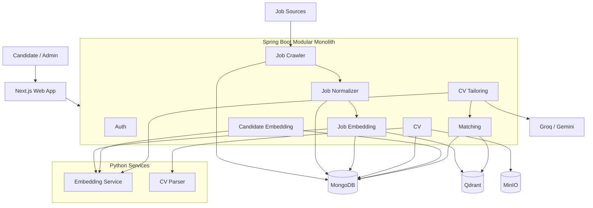

# System Architecture

AutoJob is a full-stack intelligent job matching platform that transforms job postings and candidate CVs into structured, versioned data for semantic retrieval, explainable ranking, and evidence-grounded CV tailoring.

## Overview

The system is built around two main pipelines.

### Job Pipeline

```text
Job Sources
    ↓
Crawl
    ↓
Raw Job
    ↓
Normalize
    ↓
Job Embedding
    ↓
Qdrant
    ↓
Matching
```

### Candidate Pipeline

```text
CV Upload
    ↓
CV Parsing
    ↓
Candidate Profile
    ↓
Candidate Embedding
    ↓
Matching
    ↓
CV Tailoring
```

Rather than implementing job matching as a single AI request, AutoJob separates ingestion, normalization, semantic retrieval, structured scoring, and CV optimization into independent stages.

---

## 1. High-Level Architecture



The architecture consists of four primary layers:

```text
Next.js Frontend
        ↓
Spring Boot Backend
        ↓
Python AI Services
        ↓
MongoDB · Qdrant · MinIO
```

---

## 2. Frontend

Location:

```text
frontend/web-app
```

Main technologies:

```text
Next.js 16
React 19
TypeScript
Tailwind CSS
TanStack Query
Axios
next-intl
Zustand
```

Main routes include:

```text
/login
/register
/jobs
/cv
/matches
/admin
```

The application supports:

```text
Vietnamese
English
```

with Vietnamese as the default locale.

The frontend is responsible for:

* authentication UI;
* job browsing;
* CV upload and profile visualization;
* matching results;
* CV tailoring workflow;
* administrator interfaces.

Backend authorization remains authoritative even when frontend role checks are used to control the UI.

---

## 3. Backend

The Java backend follows a **modular monolith** architecture.

Composition root:

```text
backend/autojob-app
```

Current business modules:

```text
auth
job-crawler
job-normalizer
job-embedding
cv
candidate-embedding
matching
cv-tailoring
```

Shared modules include:

```text
common-dtos
common-events
embedding-client
```

This structure provides explicit domain boundaries while keeping deployment and local development simpler than a distributed microservice architecture.

---

## 4. Internal Processing

Spring application events connect major processing stages.

### Job flow

```text
Crawler
    ↓
RawJob
    ↓
JobRawCollectedEvent
    ↓
Job Normalizer
    ↓
NormalizedJob
    ↓
JobNormalizedReadyEvent
    ↓
Job Embedding
```

### Candidate flow

```text
CV Parser
    ↓
CandidateProfile
    ↓
CandidateProfileReadyEvent
    ↓
Candidate Embedding
```

These events are currently synchronous.

A message broker is not required by the current MVP architecture.

---

## 5. Job Processing

Supported crawler sources currently include:

```text
MOCK
ITVIEC
JOBOKO
TOPDEV
VIECLAM24H
```

The job pipeline is:

```text
External Source
    ↓
Apache Camel Crawler
    ↓
raw_jobs
    ↓
Normalization
    ↓
normalized_jobs
    ↓
Embedding Service
    ↓
job_embeddings
    ↓
Qdrant
```

Current job versions:

```text
Normalization = rule-v4
Job text      = job-text-v2
```

Separating raw jobs, normalized jobs, and embeddings allows derived data to be rebuilt without repeating the entire crawl process.

---

## 6. CV Processing

The candidate pipeline begins with a CV upload.

Supported formats:

```text
PDF
DOC
DOCX
```

Flow:

```text
CV Upload
    ↓
MinIO
    ↓
raw_cvs
    ↓
CV Parser Service
    ↓
candidate_profiles
    ↓
CandidateProfileReadyEvent
    ↓
Candidate Embedding
    ↓
candidate_embeddings
```

Current parser version:

```text
rule-v2
```

Current candidate embedding text version:

```text
candidate-text-v2
```

Candidate profiles and candidate embeddings are stored separately so failed embedding generation does not invalidate successfully parsed CV data.

---

## 7. AI Services

AutoJob currently uses two Python services.

### Embedding Service

Location:

```text
ai-services/embedding-service
```

Model:

```text
intfloat/multilingual-e5-small
```

Current vector configuration:

```text
Dimension     = 384
Normalization = L2
```

The service is used for:

```text
job embeddings
candidate embeddings
CV-tailoring preview embeddings
```

### CV Parser Service

Location:

```text
ai-services/cv-parser-service
```

Responsibilities include extracting:

```text
identity
contact information
skills
work experience
projects
education
certifications
languages
experience years
seniority
```

Python services perform specialized computation, while Java remains responsible for business persistence.

---

## 8. Matching Engine

The matching engine combines semantic retrieval with structured compatibility.

```text
Candidate Embedding
        ↓
Qdrant Retrieval
        ↓
Normalized Job Hydration
        ↓
Eligibility Filtering
        ↓
Hybrid Scoring
        ↓
Acceptance Filtering
        ↓
Ranked Results
```

Current ranking version:

```text
hybrid-v6-balanced-r7
```

Current weights:

| Component | Weight |
| --------- | -----: |
| Semantic  |    40% |
| Skills    |    40% |
| Seniority |    10% |
| Location  |     5% |
| Freshness |     5% |

Semantic similarity is used as one ranking signal rather than being treated as a direct match probability.

Matching results can expose:

```text
score breakdown
matched skills
missing skills
match tier
explanations
```

---

## 9. CV Tailoring

CV Tailoring uses the candidate profile, current job match, and available candidate evidence to generate job-specific improvements.

Flow:

```text
Candidate Profile
        +
Matched Job
        ↓
Evidence Analysis
        ↓
Suggestions
        ↓
Optional AI Rewrite
        ↓
Safety Validation
        ↓
Temporary Preview
        ↓
Before / After Matching
```

Supported suggestion types:

```text
REWRITE
EMPHASIZE
GAP_WARNING
```

AI rewriting is evidence-constrained.

The system is designed to improve the presentation of existing candidate information without inventing unsupported:

```text
skills
experience
projects
metrics
certifications
education
job titles
achievements
```

Current provider order when both are enabled:

```text
Groq
 ↓
Gemini
```

If AI rewriting is unavailable, deterministic emphasis and gap analysis can still operate.

---

## 10. Data Storage

AutoJob uses three primary storage technologies.

### MongoDB

Stores application business data:

```text
users
refresh_tokens

raw_jobs
normalized_jobs
job_embeddings

raw_cvs
candidate_profiles
candidate_embeddings

match_results
```

### Qdrant

Stores searchable job vectors.

Current collection:

```text
job_vectors_v1
```

MongoDB remains the canonical source of job information.

Qdrant is used as a semantic retrieval index.

### MinIO

Stores original uploaded CV files.

Default local bucket:

```text
autojob-cvs
```

---

## 11. Authentication and Authorization

Authentication uses:

```text
JWT access token
+
rotating refresh token
```

Current roles:

```text
USER
ADMIN
```

General access model:

```text
Public
├── authentication
└── health / API documentation

USER / ADMIN
├── jobs
├── CV
├── matching
└── CV tailoring

ADMIN
├── crawlers
├── raw jobs
├── normalization administration
├── parser utilities
└── embedding administration
```

Unconfigured `/api/**` routes are denied by default.

---

## 12. Version Compatibility

AutoJob explicitly versions machine-facing representations that influence matching.

Current configuration:

| Component                | Version                 |
| ------------------------ | ----------------------- |
| CV Parser                | `rule-v2`               |
| Job Normalization        | `rule-v4`               |
| Job Embedding Text       | `job-text-v2`           |
| Candidate Embedding Text | `candidate-text-v2`     |
| Matching                 | `hybrid-v6-balanced-r7` |
| CV Rewrite Prompt        | `cv-rewrite-v1`         |
| Embedding Dimension      | `384`                   |
| Qdrant Collection        | `job_vectors_v1`        |

Version compatibility prevents stale embeddings or previous representations from being silently mixed with the current matching pipeline.

---

## 13. Architecture Principles

The current implementation follows several core principles:

```text
Keep business persistence in Java.

Use Python for specialized AI/document processing.

Separate canonical business data from derived semantic indexes.

Version representations that affect retrieval or ranking.

Treat semantic similarity as evidence, not probability.

Prefer fewer relevant matches over padded results.

Do not fabricate candidate information during CV tailoring.

Add distributed infrastructure only when operational requirements justify it.
```

AutoJob is currently designed as a full-stack MVP with clear module boundaries and a migration path toward more durable asynchronous processing, observability, and production infrastructure as the system evolves.
