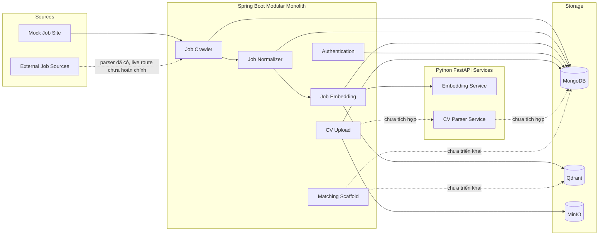
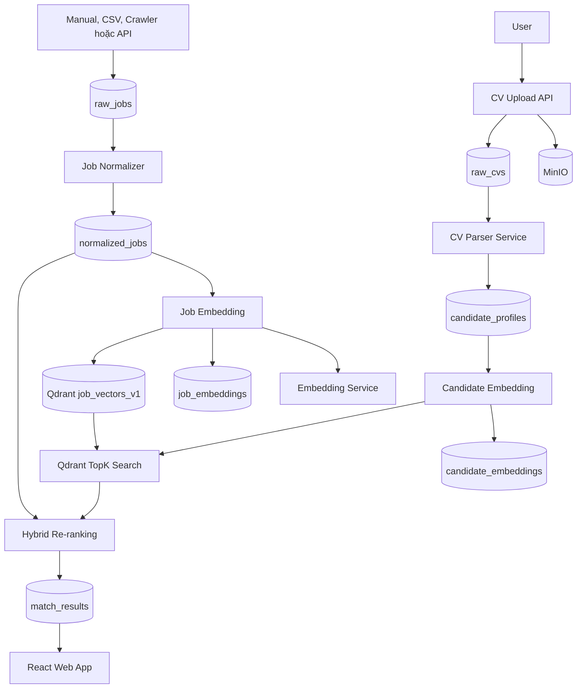

# AutoJob Architecture

Tài liệu này mô tả kiến trúc tổng thể, module boundary và luồng giao tiếp giữa các thành phần trong AutoJob.

---

## 1. Mục tiêu kiến trúc

AutoJob sử dụng kiến trúc:

```text
Spring Boot Modular Monolith
+
Python FastAPI Services
+
Self-hosted Local Infrastructure
```

Tư duy chính:

```text
Code như microservices, chạy như monolith.
```

Các bounded context được tách thành Maven module riêng, nhưng Java backend chỉ có một main application:

```text
backend/autojob-app
```

Cách tổ chức này giúp:

* Giảm độ phức tạp khi phát triển local.
* Không phải quản lý nhiều Java application ngay từ đầu.
* Giữ boundary rõ giữa các domain.
* Dễ viết unit test riêng cho từng module.
* Có thể tách module thành service riêng khi thật sự cần.
* Tránh sử dụng message broker quá sớm.

---

## 2. Kiến trúc hiện tại



---

## 3. Kiến trúc mục tiêu của MVP



---

## 4. Repository module map

```text
backend/
├── pom.xml
├── autojob-app/
├── common/
│   ├── common-dtos/
│   └── common-events/
└── modules/
    ├── auth/
    ├── cv/
    ├── job-crawler/
    ├── job-normalizer/
    ├── job-embedding/
    └── matching/
```

---

## 5. Main application

### Đường dẫn

```text
backend/autojob-app/
```

### Trách nhiệm

`autojob-app` là entry point duy nhất của Java backend.

Main class:

```text
backend/autojob-app/src/main/java/com/autojob/app/AutoJobApplication.java
```

Module này:

* Khởi động Spring Boot.
* Load các module domain thông qua Maven dependency.
* Cung cấp cấu hình MongoDB.
* Cung cấp cấu hình MinIO.
* Cung cấp WebClient.
* Cung cấp cấu hình Qdrant.
* Cung cấp actuator health endpoint.
* Đọc application properties chung.

`autojob-app` không nên chứa business logic của crawler, CV hoặc matching.

Business logic phải nằm trong module tương ứng.

---

## 6. Common modules

### 6.1. `common-dtos`

Đường dẫn:

```text
backend/common/common-dtos/
```

Chứa các DTO và enum cần dùng bởi nhiều domain module.

Hiện có:

```text
ApplyType
```

Các giá trị:

```text
DETAIL_PAGE
DETAIL_PAGE_APPLY_BUTTON
EXTERNAL_COMPANY_SITE
EMAIL
UNKNOWN
```

Không đưa mọi DTO vào `common-dtos`.

Chỉ đưa vào common khi:

* Có ít nhất hai module cần dùng.
* DTO không thuộc ownership riêng của một domain.
* Việc phụ thuộc không làm phá boundary.

---

### 6.2. `common-events`

Đường dẫn:

```text
backend/common/common-events/
```

Hiện có:

```text
JobRawCollectedEvent
JobNormalizedReadyEvent
```

Các event này là Spring Application Event trong cùng JVM.

Chúng không phải:

* RabbitMQ message.
* Kafka message.
* Distributed event.
* Event được bảo đảm lưu bền vững.

Event hiện tại giúp giảm coupling trực tiếp giữa các module nhưng vẫn chạy trong một application process.

---

## 7. Authentication module

### Đường dẫn

```text
backend/modules/auth/
```

### Trách nhiệm

* Đăng ký tài khoản.
* Đăng nhập.
* Hash password bằng BCrypt.
* Tạo JWT access token.
* Quản lý refresh token.
* Rotate refresh token.
* Logout và revoke session.
* Xác định role.
* Rate limit.
* CORS.
* Bảo vệ API bằng Spring Security.

### MongoDB collections

```text
users
refresh_tokens
```

### API

```text
POST /api/auth/register
POST /api/auth/login
POST /api/auth/refresh
POST /api/auth/logout
GET  /api/auth/me
```

### Local public API mode

Cấu hình:

```dotenv
AUTH_PUBLIC_API_MODE=true
```

Khi bật, các endpoint khác vẫn public để dễ kiểm tra local.

JWT hợp lệ vẫn có thể được parse để xác định user hiện tại.

---

## 8. Job Crawler module

### Đường dẫn

```text
backend/modules/job-crawler/
```

### Trách nhiệm

* Crawl job source.
* Parse list page.
* Parse detail page.
* Tạo raw job.
* Tạo fingerprint.
* Upsert MongoDB collection `raw_jobs`.
* Publish `JobRawCollectedEvent`.
* Cung cấp parser test endpoint.
* Cung cấp Source Discovery skeleton.

### Không chịu trách nhiệm

* Chuẩn hóa skill sâu.
* Chuẩn hóa salary.
* Tạo embedding.
* Match candidate.
* Tự động apply.
* Gọi private API của website tuyển dụng.

### Mock crawler

Mock route sử dụng:

```text
MockJobCrawlerRoute
ListPageProcessor
DetailPageProcessor
```

Luồng:

```text
GET mock list page
→ parse detail URLs
→ GET detail page
→ parse raw job
→ save MongoDB
→ publish event
```

### Website parser hiện có

Repository có parser hoặc fixture cho một số source như:

```text
MOCK
ITVIEC
JOBOKO
TOPDEV
VIECLAM24H
```

Sự tồn tại của parser không có nghĩa là live crawler production đã hoàn chỉnh.

Selector website có thể thay đổi và cần được kiểm tra trước khi chạy.

---

## 9. Job Normalizer module

### Đường dẫn

```text
backend/modules/job-normalizer/
```

### Trách nhiệm

* Nhận `JobRawCollectedEvent`.
* Load raw job.
* Chuẩn hóa text.
* Chuẩn hóa title.
* Chuẩn hóa skill.
* Chuẩn hóa location.
* Parse salary.
* Parse experience.
* Xác định seniority.
* Xác định job type.
* Parse posted date và deadline.
* Chọn apply URL.
* Build `embeddingText`.
* Lưu `normalized_jobs`.
* Publish `JobNormalizedReadyEvent`.

### Luồng

```text
JobRawCollectedEvent
→ JobRawCollectedEventListener
→ JobNormalizationService
→ normalized_jobs
→ JobNormalizedReadyEvent
```

### Versioning

Mỗi normalized job có:

```text
normalizationVersion
```

Giá trị mặc định:

```text
rule-v1
```

Unique business key:

```text
rawJobId + normalizationVersion
```

Khi logic normalization thay đổi, tăng version thay vì ghi đè dữ liệu cũ một cách không kiểm soát.

---

## 10. Job Embedding module

### Đường dẫn

```text
backend/modules/job-embedding/
```

### Trách nhiệm

* Nhận `JobNormalizedReadyEvent`.
* Load normalized job.
* Tính hash của `embeddingText`.
* Gọi FastAPI embedding service.
* Validate vector dimension.
* Validate embedding version.
* Lưu metadata vào `job_embeddings`.
* Tạo Qdrant collection nếu cần.
* Upsert vector vào Qdrant.

### Luồng

```text
JobNormalizedReadyEvent
→ JobNormalizedReadyEventListener
→ JobEmbeddingService
→ EmbeddingClient
→ embedding-service
→ job_embeddings
→ Qdrant
```

### Versioning

Embedding có:

```text
embeddingVersion
```

Ví dụ real provider:

```text
intfloat/multilingual-e5-small@<revision>|prep-v1|l2
```

Ví dụ fake provider:

```text
autojob/fake-sha256@deterministic-v1|prep-v1|l2
```

Unique business key:

```text
normalizedJobId + embeddingVersion
```

### Qdrant payload

Payload chỉ nên chứa dữ liệu tối thiểu:

```json
{
  "jobId": "normalized-job-id",
  "sourceCode": "MOCK",
  "embeddingVersion": "embedding-version"
}
```

Full job detail vẫn được đọc từ MongoDB.

---

## 11. CV module

### Đường dẫn

```text
backend/modules/cv/
```

### Trách nhiệm hiện tại

* Nhận multipart upload.
* Kiểm tra extension.
* Kiểm tra file content.
* Kiểm tra file size.
* Tính SHA-256.
* Tạo MinIO object key.
* Lưu file vào MinIO.
* Lưu metadata vào `raw_cvs`.
* Trả metadata CV qua REST API.

### API hiện tại

```text
POST /api/cvs
GET  /api/cvs/{rawCvId}
```

### Chưa tích hợp

* Gọi CV parser.
* Lưu candidate profile.
* Build candidate `embeddingText`.
* Tạo candidate embedding.
* Trigger Matching Engine.

---

## 12. CV Parser service

### Đường dẫn

```text
ai-services/cv-parser-service/
```

### Trạng thái

CV parser không còn là placeholder.

Service hiện có các thành phần:

* MinIO object downloader.
* PDF extractor.
* DOCX extractor.
* DOC extractor sử dụng `antiword`.
* Text normalizer.
* Section detector.
* Identity parser.
* Contact parser.
* Skill parser.
* Work experience parser.
* Education parser.
* Project parser.
* Certification parser.
* Language parser.
* Experience calculator.
* Seniority parser.
* Parse quality calculator.
* YAML taxonomy.
* Unit test và integration test.

### Endpoint

```text
POST /api/v1/cv/parse
GET  /health
GET  /ready
```

### Trạng thái tích hợp

Service chưa được:

* Thêm vào root `docker-compose.yml`.
* Cấu hình client trong Java backend.
* Nối với `CvUploadService`.
* Dùng để lưu `candidate_profiles`.

---

## 13. Embedding service

### Đường dẫn

```text
ai-services/embedding-service/
```

### Trách nhiệm

* Nhận text.
* Preprocess text.
* Tạo vector.
* Normalize vector.
* Trả model metadata.
* Trả embedding version.
* Trả text hash hoặc dữ liệu phục vụ kiểm tra version.

### Provider

#### Sentence Transformer

Model mặc định:

```text
intfloat/multilingual-e5-small
```

Dimension:

```text
384
```

#### Fake deterministic provider

Dùng để:

* Smoke test pipeline.
* Chạy local nhanh.
* Tránh tải model trong lúc kiểm tra integration.
* Tạo output ổn định cho cùng input.

Fake embedding không dùng để đánh giá semantic matching thực tế.

---

## 14. Matching module

### Đường dẫn

```text
backend/modules/matching/
```

### Trạng thái hiện tại

Module hiện chỉ là scaffold.

Nó chưa nằm trong danh sách module của:

```text
backend/pom.xml
```

và chưa được thêm làm dependency của:

```text
backend/autojob-app/pom.xml
```

Do đó code trong module này chưa tham gia runtime application.

### Trách nhiệm mục tiêu

* Nhận candidate vector.
* Search topK job vector trong Qdrant.
* Lấy danh sách normalized job từ MongoDB.
* Tính rule-based component score.
* Tính final score.
* Lưu `match_results`.
* Trả danh sách job kèm lý do match.

---

## 15. Module dependency direction

Dependency mong muốn:

```text
autojob-app
    |
    +--> auth
    +--> cv
    +--> job-crawler
    +--> job-normalizer
    +--> job-embedding
    +--> matching
```

Job pipeline:

```text
job-crawler
    |
    +--> common-events
    +--> common-dtos

job-normalizer
    |
    +--> job-crawler domain/repository
    +--> common-events
    +--> common-dtos

job-embedding
    |
    +--> job-normalizer
    +--> common-events
```

Cần tránh dependency vòng:

```text
job-crawler → job-normalizer → job-crawler
```

Nếu hai module cần chia sẻ contract, đưa contract tối thiểu vào `common-events` hoặc `common-dtos`, không đưa toàn bộ domain model vào common.

---

## 16. Job pipeline hiện tại

```text
POST /api/admin/crawlers/mock/run
    |
    v
MockJobCrawlerRoute
    |
    v
RawJobService
    |
    +--> MongoDB raw_jobs
    |
    +--> JobRawCollectedEvent
             |
             v
JobRawCollectedEventListener
             |
             v
JobNormalizationService
             |
             +--> MongoDB normalized_jobs
             |
             +--> JobNormalizedReadyEvent
                       |
                       v
JobNormalizedReadyEventListener
                       |
                       v
JobEmbeddingService
                       |
                       +--> embedding-service
                       +--> MongoDB job_embeddings
                       +--> Qdrant job_vectors_v1
```

Các Spring Application Event hiện được xử lý trong cùng Java process.

Chưa có:

* Distributed queue.
* Dead-letter queue.
* Outbox pattern.
* Durable event retry.
* Event replay tự động.

Ở giai đoạn hiện tại, có thể dùng admin API để normalize hoặc rebuild embedding thủ công khi cần.

---

## 17. CV pipeline mục tiêu

```text
POST /api/cvs
    |
    v
CvUploadService
    |
    +--> MinIO
    |
    +--> MongoDB raw_cvs
             |
             v
CvParsingService
             |
             +--> cv-parser-service
             |
             +--> MongoDB candidate_profiles
                       |
                       v
CandidateEmbeddingService
                       |
                       +--> embedding-service
                       |
                       +--> candidate_embeddings
                                 |
                                 v
MatchingService
                                 |
                                 +--> Qdrant search
                                 +--> MongoDB normalized_jobs
                                 +--> match_results
```

MVP có thể bắt đầu bằng synchronous orchestration.

Chỉ thêm RabbitMQ khi xuất hiện nhu cầu thật:

* Parser mất nhiều thời gian.
* Cần retry bền vững.
* Có nhiều CV xử lý đồng thời.
* Cần scale Python service riêng.
* Request đồng bộ thường xuyên bị timeout.

---

## 18. Data ownership

| Dữ liệu                    | Owner                              |
| -------------------------- | ---------------------------------- |
| `users`                    | Auth module                        |
| `refresh_tokens`           | Auth module                        |
| `raw_cvs`                  | CV module                          |
| `candidate_profiles`       | CV module                          |
| `candidate_embeddings`     | CV hoặc Candidate Embedding module |
| `raw_jobs`                 | Job Crawler module                 |
| `normalized_jobs`          | Job Normalizer module              |
| `job_embeddings`           | Job Embedding module               |
| `match_results`            | Matching module                    |
| `website_sources`          | Source Discovery                   |
| `source_discovery_results` | Source Discovery                   |
| `crawler_sources`          | Job Crawler module                 |
| `job_vectors_v1`           | Job Embedding module               |
| MinIO CV objects           | CV module                          |

Module khác không nên ghi trực tiếp vào collection không thuộc ownership của mình nếu có thể gọi service hoặc dùng event.

---

## 19. MongoDB và Qdrant

### MongoDB

MongoDB giữ:

* Business data đầy đủ.
* Dữ liệu hiển thị.
* Version metadata.
* Processing status.
* Error metadata.
* Quan hệ giữa raw và normalized object.

### Qdrant

Qdrant giữ:

* Vector.
* Point ID.
* Payload tối thiểu.
* Embedding version.
* ID tham chiếu về MongoDB.

Qdrant không giữ full description, requirement hoặc toàn bộ job document.

---

## 20. MinIO

MinIO lưu file CV gốc.

Bucket mặc định:

```text
autojob-cvs
```

Object key được tổ chức theo dạng:

```text
raw/YYYY/MM/DD/{rawCvId}/{safeFilename}
```

MongoDB chỉ lưu metadata và đường dẫn object.

API public không nên trả trực tiếp:

```text
bucket
objectKey
storage credentials
uploadedFromIp
internal error
```

---

## 21. Idempotency

### Raw job

Dùng:

```text
fingerprint
```

Fingerprint có unique index.

Khi crawler thấy lại cùng job:

* Không tạo document trùng.
* Update `lastSeenAt`.
* Update field thay đổi.
* Giữ `firstSeenAt`.
* Có thể publish event để normalizer kiểm tra content hash.

### Normalized job

Dùng unique key:

```text
rawJobId + normalizationVersion
```

Dùng content hash để bỏ qua normalization output không thay đổi.

### Job embedding

Dùng unique key:

```text
normalizedJobId + embeddingVersion
```

Dùng `textHash` để không gọi embedding service khi text không đổi.

### Candidate profile mục tiêu

Dùng:

```text
rawCvId + parserVersion
```

### Candidate embedding mục tiêu

Dùng:

```text
candidateProfileId + embeddingVersion
```

### Match result mục tiêu

Dùng:

```text
candidateProfileId
+ normalizedJobId
+ candidateEmbeddingVersion
+ jobEmbeddingVersion
+ rankingVersion
```

---

## 22. Versioning

Các version quan trọng:

```text
normalizationVersion
parserVersion
embeddingVersion
rankingVersion
```

Version giúp:

* Reprocess dữ liệu khi logic đổi.
* So sánh kết quả cũ và mới.
* Không ghi đè output mà không biết nguồn.
* Rebuild Qdrant theo embedding model mới.
* Giải thích vì sao điểm matching thay đổi.

Không dùng một field chung như:

```text
version = 1
```

cho tất cả pipeline.

Mỗi loại processing phải có version riêng.

---

## 23. Error handling boundary

### Crawler

Nên trả lỗi thuộc nhóm:

```text
NETWORK_ERROR
ROBOTS_DISALLOWED
HTTP_401
HTTP_403
HTTP_429
CAPTCHA_DETECTED
LOGIN_REQUIRED
SELECTOR_BROKEN
DETAIL_PARSE_FAILED
```

### CV upload

```text
CV_EMPTY_FILE
CV_UNSUPPORTED_FILE
CV_INVALID_CONTENT
CV_FILE_TOO_LARGE
CV_STORAGE_ERROR
```

### CV parser

```text
CV_OBJECT_NOT_FOUND
CV_EXTRACTION_TIMEOUT
CV_TEXT_TOO_SHORT
CV_PARSE_FAILED
CV_PARSER_UNAVAILABLE
```

### Embedding

```text
EMBEDDING_SERVICE_UNAVAILABLE
EMBEDDING_VERSION_MISMATCH
EMBEDDING_DIMENSION_MISMATCH
QDRANT_UPSERT_FAILED
```

### Matching

```text
CANDIDATE_EMBEDDING_NOT_FOUND
NO_ACTIVE_JOB_EMBEDDING
VECTOR_SEARCH_FAILED
MATCHING_FAILED
```

Không expose Python hoặc Java stack trace trực tiếp cho frontend.

---

## 24. Crawler boundary

Crawler chỉ xử lý dữ liệu public.

Không thực hiện:

* Login khi chưa có quyền hợp lệ.
* Bypass CAPTCHA.
* Bypass anti-bot.
* Proxy rotation hoặc stealth scraping.
* Gọi private API ứng tuyển.
* Tự động ứng tuyển thay người dùng.
* Thu thập dữ liệu ẩn sau authentication.

Crawler cần:

* Kiểm tra robots.txt.
* Rate limit theo domain.
* User-Agent rõ ràng.
* Dừng khi gặp `401`, `403`, `429`, CAPTCHA hoặc login wall.
* Lưu fingerprint.
* Lưu source metadata.
* Có khả năng disable source bị hỏng.

---

## 25. Nguyên tắc mở rộng

Chưa tách module thành microservice chỉ vì module đã lớn.

Chỉ cân nhắc tách khi có một trong các dấu hiệu:

* Cần scale riêng.
* Có vòng đời release riêng.
* Có resource profile khác biệt rõ.
* Có nhiều team cùng phát triển.
* Cần isolation khi service lỗi.
* Giao tiếp async đã trở thành nhu cầu thật.

Trước khi tách, module cần có:

* API hoặc event contract rõ.
* Ownership dữ liệu rõ.
* Không truy cập repository chéo tùy tiện.
* Idempotency.
* Versioning.
* Test boundary.
