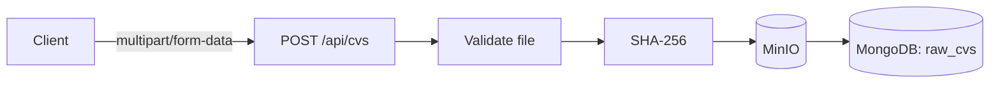
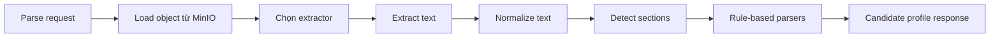
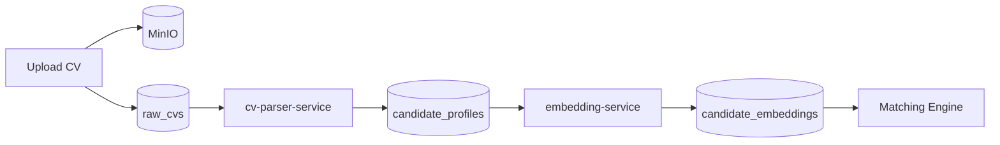

# CV pipeline

## Tổng quan

CV pipeline mục tiêu:

```text
Upload CV
→ MinIO
→ raw_cvs
→ CV Parser
→ candidate_profiles
→ Candidate Embedding
→ Matching Engine
```

Trong repository hiện tại, pipeline mới được tích hợp đến bước:

```text
Upload CV
→ validate file
→ lưu MinIO
→ lưu raw_cvs
```

`cv-parser-service` đã có implementation tương đối đầy đủ, nhưng Java backend chưa gọi service này. Các bước lưu candidate profile, tạo candidate embedding và matching chưa được triển khai.

## Trạng thái

| Thành phần                  | Trạng thái                         |
| --------------------------- | ---------------------------------- |
| API upload CV               | Đã tích hợp                        |
| Validate PDF, DOC, DOCX     | Đã tích hợp                        |
| Lưu file vào MinIO          | Đã tích hợp                        |
| Lưu metadata vào `raw_cvs`  | Đã tích hợp                        |
| API đọc metadata CV         | Đã tích hợp                        |
| CV Parser FastAPI           | Có code và test, chưa nối với Java |
| Cập nhật trạng thái parsing | Chưa tích hợp                      |
| Lưu `candidate_profiles`    | Chưa triển khai                    |
| Candidate `embeddingText`   | Chưa triển khai                    |
| Candidate embedding         | Chưa triển khai                    |
| Trigger Matching Engine     | Chưa triển khai                    |

## Upload flow hiện tại



API upload:

```text
POST /api/cvs
Content-Type: multipart/form-data
```

Multipart field:

```text
file
```

Ví dụ:

```bash
curl -s -X POST \
  http://localhost:8080/api/cvs \
  -F "file=@./sample-cv.pdf" \
  | jq
```

Response chính:

```json
{
  "id": "2f3f7f45-c011-4a86-8f4d-bcf3eca99af2",
  "ownerUserId": null,
  "originalFilename": "sample-cv.pdf",
  "extension": "pdf",
  "contentType": "application/pdf",
  "sizeBytes": 185320,
  "sha256": "...",
  "status": "UPLOADED",
  "uploadedAt": "..."
}
```

Khi request có JWT hợp lệ, `ownerUserId` được lấy từ authentication principal. Trong local public mode, field này có thể là `null`.

## File validation

Java backend chỉ chấp nhận:

```text
PDF
DOC
DOCX
```

Validation không chỉ dựa vào extension.

### PDF

File phải bắt đầu bằng PDF signature:

```text
%PDF-
```

### DOC

File phải có OLE Compound Document signature.

### DOCX

Backend mở file như ZIP và kiểm tra tối thiểu:

```text
[Content_Types].xml
word/document.xml
```

File có extension hợp lệ nhưng signature hoặc cấu trúc không đúng sẽ bị từ chối.

Giới hạn mặc định:

```text
CV file:      10 MB
HTTP request: 11 MB
```

Các biến cấu hình:

```dotenv
CV_MAX_FILE_SIZE_MB=10
CV_MAX_FILE_SIZE=10MB
CV_MAX_REQUEST_SIZE=11MB
```

Implementation hiện đọc toàn bộ file vào bộ nhớ trước khi upload MinIO. Với giới hạn 10 MB, cách làm này phù hợp cho MVP nhưng không nên tăng giới hạn lớn mà không đổi sang streaming.

## Chuẩn hóa filename

Tên file được xử lý trước khi tạo MinIO object:

* Loại bỏ directory path từ client.
* Chỉ giữ chữ cái, chữ số, `.`, `_` và `-`.
* Ký tự khác được thay bằng `_`.
* Giới hạn tối đa 180 ký tự.

Ví dụ:

```text
Nguyễn Văn A - CV 2026.pdf
```

có thể được lưu thành:

```text
Nguy_n_V_n_A_-_CV_2026.pdf
```

Tên này được dùng làm `originalFilename` trong `raw_cvs`, nên hiện tại backend không giữ riêng filename nguyên bản chưa sanitize.

## Lưu file vào MinIO

Bucket mặc định:

```text
autojob-cvs
```

Object key:

```text
raw/yyyy/MM/dd/{rawCvId}/{safeFilename}
```

Ví dụ:

```text
raw/2026/08/02/2f3f7f45-c011-4a86-8f4d-bcf3eca99af2/sample-cv.pdf
```

Phần ngày được tính theo UTC.

Bucket được giữ private. Docker Compose có container `minio-init` để tạo bucket, đồng thời Java backend cũng có `ApplicationRunner` kiểm tra và tạo bucket nếu chưa tồn tại.

Backend upload object trước, sau đó mới lưu metadata vào MongoDB.

Nếu ghi MongoDB thất bại sau khi object đã được upload, backend thực hiện best-effort delete để tránh object mồ côi:

```text
Upload MinIO thành công
→ MongoDB save lỗi
→ thử xóa object MinIO
→ trả CV_METADATA_SAVE_FAILED
```

## Collection `raw_cvs`

`raw_cvs` giữ metadata của file gốc:

```text
id
ownerUserId
bucket
objectKey
originalFilename
extension
contentType
sizeBytes
sha256
status
lastError
uploadedFromIp
uploadedAt
```

Các index hiện có:

```text
ownerUserId + uploadedAt descending
sha256
```

Index `sha256` không phải unique index. Upload cùng một file nhiều lần vẫn tạo nhiều `raw_cvs` và nhiều MinIO object khác nhau.

Các status được khai báo:

```text
UPLOADED
PARSING
PARSED
FAILED
```

Tuy nhiên code Java hiện chỉ gán:

```text
UPLOADED
```

Chưa có service nào chuyển status sang `PARSING`, `PARSED` hoặc `FAILED`.

## Đọc metadata CV

API:

```text
GET /api/cvs/{rawCvId}
```

Ví dụ:

```bash
RAW_CV_ID="<raw-cv-id>"

curl -s \
  "http://localhost:8080/api/cvs/${RAW_CV_ID}" \
  | jq
```

Response không trả:

* MinIO bucket.
* MinIO object key.
* Upload IP.
* `lastError`.

Điều này tránh expose trực tiếp storage location qua public API.

API hiện chưa kiểm tra người gọi có phải owner của CV hay không. Với `AUTH_PUBLIC_API_MODE=true`, metadata có thể được đọc chỉ bằng `rawCvId`.

## Rate limit

CV upload có rate-limit group riêng.

Giá trị mặc định:

```text
10 request mỗi giờ
```

Cấu hình:

```dotenv
RATE_LIMIT_CV_UPLOAD_CAPACITY=10
RATE_LIMIT_CV_UPLOAD_PERIOD=1h
```

Rate limit này áp dụng ở HTTP layer; nó không thay thế file validation hoặc authorization.

## CV Parser FastAPI

### Trạng thái

`ai-services/cv-parser-service` không còn là một thư mục rỗng. Service đã có implementation và test cho:

* MinIO object loading.
* PDF extraction.
* DOC extraction.
* DOCX extraction.
* Text normalization.
* Section detection.
* Identity và contact parsing.
* Skill taxonomy.
* Work experience.
* Education.
* Certification và license.
* Language.
* Career preference.
* Experience-year calculation.
* Seniority inference.
* Parse warnings và parse quality.

Tuy nhiên service chưa:

* Có service entry trong `docker-compose.yml`.
* Có Java HTTP client.
* Được gọi sau khi upload.
* Cập nhật `raw_cvs`.
* Lưu kết quả vào `candidate_profiles`.

Vì vậy đây là **code đã có nhưng chưa nối vào pipeline**.

## Parser runtime flow



API:

```text
POST /api/v1/cv/parse
```

Request:

```json
{
  "rawCvId": "2f3f7f45-c011-4a86-8f4d-bcf3eca99af2",
  "bucket": "autojob-cvs",
  "objectKey": "raw/2026/08/02/2f3f7f45-c011-4a86-8f4d-bcf3eca99af2/sample-cv.pdf",
  "originalFilename": "sample-cv.pdf",
  "contentType": "application/pdf"
}
```

Parser chỉ cho phép:

* Bucket đúng với `MINIO_BUCKET_CVS`.
* Object key an toàn.
* Object key bắt đầu bằng prefix cho phép, mặc định là `raw/` hoặc `cvs/`.
* Object không vượt quá giới hạn kích thước.
* Extension khớp với content type.

Service đọc trực tiếp file từ MinIO. Java backend không cần download file rồi upload lại sang Python.

## Extractor theo định dạng

### PDF

Dùng PyMuPDF.

Parser kiểm tra:

* PDF signature.
* File có bị lỗi hay không.
* PDF có password hay không.
* Số trang không vượt quá giới hạn.
* Có đủ text để parse hay không.

Parser không có OCR. CV dạng scanned image không có text layer sẽ không được parse thành công.

Parser có thể cảnh báo khi phát hiện layout nhiều cột:

```text
MULTI_COLUMN_LAYOUT_SUSPECTED
TEXT_LAYOUT_MAY_BE_LOST
```

### DOCX

Dùng `python-docx`.

Parser đọc:

* Paragraph.
* Table.
* Header.
* Footer.

Trước khi parse, service kiểm tra cấu trúc ZIP để giảm rủi ro:

* Archive path không an toàn.
* Số lượng entry quá lớn.
* Uncompressed size quá lớn.
* Compression ratio đáng ngờ.
* File Office không chứa DOCX document.

### DOC

Dùng command:

```text
antiword
```

Binary này đã được cài trong Dockerfile của parser.

Nếu chạy service trực tiếp ngoài Docker, máy local cũng phải có `antiword` trong `PATH`.

## Parser output

Response cấp cao:

```json
{
  "rawCvId": "...",
  "parserVersion": "rule-v1",
  "extractedTextLength": 12540,
  "detectedLanguage": "VI",
  "profile": {},
  "warnings": []
}
```

Candidate profile có thể chứa các nhóm dữ liệu:

* Họ tên, headline, professional summary và career objective.
* Email, phone, address và public links.
* Target job titles và career preferences.
* Skills đã normalize.
* Work experience và project experience.
* Education, certification, license và training.
* Languages.
* Experience years.
* Seniority.
* Recent job titles và companies.
* Raw extracted text.
* Detected sections.
* Parser warnings.
* Parse quality.

Parser là rule-based và taxonomy-based. Source code hiện không gọi LLM.

Khi không đủ evidence, parser có xu hướng để field trống hoặc thêm warning thay vì tự tạo dữ liệu.

## Health và readiness

Endpoints:

```text
GET /health
GET /ready
```

`/health` chỉ xác nhận FastAPI process hoạt động.

`/ready` kiểm tra thêm:

* MinIO bucket có truy cập được hay không.
* `antiword` có tồn tại hay không.
* Taxonomy đã load thành công hay không.

Readiness response có thể là:

```json
{
  "status": "UP",
  "parserVersion": "rule-v1",
  "taxonomyVersion": "rule-v1",
  "minio": "UP",
  "docExtractor": "UP",
  "details": []
}
```

## Candidate profile persistence

### Chưa triển khai

Java backend chưa có:

```text
CandidateProfile
CandidateProfileRepository
CvParserClient
CvParsingService
CvParserResponseValidator
```

Một số test file với tên tương ứng tồn tại trong module `cv`, nhưng hiện là file rỗng và không chứng minh implementation đã có.

### Đề xuất

Java backend nên điều phối parsing:

```text
Load raw_cvs
→ set status PARSING
→ gọi cv-parser-service
→ validate rawCvId và parserVersion
→ lưu candidate_profiles
→ set raw_cvs status PARSED
```

Khi lỗi:

```text
set raw_cvs status FAILED
set lastError
```

Python service không nên ghi trực tiếp vào MongoDB. Nó chỉ nên trả kết quả parse để Java quản lý workflow và persistence.

Logical uniqueness đề xuất:

```text
rawCvId + parserVersion
```

Cách này cho phép parse lại cùng một CV khi taxonomy hoặc parser rule thay đổi.

## Candidate embedding

### Chưa triển khai

Repository chưa có:

```text
candidate_embeddings collection
candidate embedding service orchestration
candidate vector persistence
candidate Qdrant collection
```

Embedding service hiện chỉ được Java job pipeline sử dụng.

### Đề xuất

Sau khi lưu candidate profile, Java tạo `embeddingText` từ dữ liệu đã parse:

```text
Target roles
Headline hoặc professional summary
Normalized skills
Seniority
Experience years
Preferred locations
Recent work experience
Projects
Education hoặc certifications quan trọng
```

Không nên dùng file binary hoặc match trực tiếp với `raw_cvs`.

`rawText` có thể hỗ trợ embedding, nhưng nên được giới hạn và đặt sau các section có tín hiệu cao để tránh nội dung ít quan trọng chiếm toàn bộ context.

Candidate embedding phải dùng:

* Cùng model family với job embedding.
* Cùng dimension.
* Cùng normalization rule.
* `embeddingVersion` tương thích với job vector.
* Candidate preprocessing version rõ ràng.

Metadata đề xuất cho `candidate_embeddings`:

```text
candidateProfileId
parserVersion
embeddingVersion
textHash
dimension
normalized
status
lastError
embeddedAt
```

## Pipeline mục tiêu sau khi hoàn thiện



Matching Engine phải sử dụng candidate profile và candidate embedding. Nó không được đọc file CV trực tiếp hoặc tự parse lại `rawText`.
