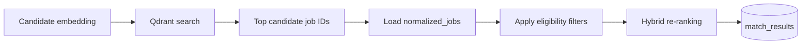

# Matching Engine

## Trạng thái hiện tại

Matching Engine chưa được triển khai.

Repository hiện có:

```text
backend/modules/matching/pom.xml
backend/modules/matching/src/main/java/com/autojob/modules/matching/.gitkeep
configs/matching/ranking.yml
```

`ranking.yml` chỉ chứa placeholder comment.

Module `matching`:

* Chưa có Java class.
* Chưa có dependency.
* Chưa nằm trong Maven reactor của `backend/pom.xml`.
* Chưa là dependency của `autojob-app`.
* Chưa có API.
* Chưa có MongoDB collection.
* Chưa search Qdrant.
* Chưa có ranking logic.

Toàn bộ nội dung kỹ thuật phía dưới là **kế hoạch hoặc đề xuất**, không phải mô tả tính năng đang hoạt động.

## Mục tiêu

Matching Engine nhận candidate profile và candidate embedding, tìm các job gần nhất trong Qdrant, sau đó re-rank bằng các tín hiệu nghiệp vụ.

```text
Candidate vector
→ tìm topK job trong Qdrant
→ load normalized_jobs từ MongoDB
→ rule-based re-ranking
→ match_results
→ trả kết quả cho frontend
```

Matching Engine không match trực tiếp với:

```text
raw_cvs
raw_jobs
raw HTML
file PDF/DOC/DOCX
```

Đầu vào phải là dữ liệu đã parse và normalize.

## Vai trò của Qdrant và MongoDB

### Qdrant

Qdrant thực hiện candidate retrieval bằng semantic vector search.

Collection job hiện có:

```text
job_vectors_v1
```

Payload hiện tại:

```json
{
  "jobId": "<normalizedJobId>",
  "sourceCode": "MOCK",
  "normalizationVersion": "rule-v1",
  "embeddingVersion": "...",
  "textHash": "..."
}
```

Field `jobId` hiện liên kết với document trong `normalized_jobs`.

Qdrant không chứa đầy đủ job detail và không phải source of truth.

### MongoDB

Sau khi Qdrant trả về top job IDs, Matching Engine phải load:

```text
normalized_jobs
```

MongoDB cung cấp dữ liệu để:

* Re-ranking.
* Tạo match explanation.
* Hiển thị title, company, salary và location.
* Trả `detailUrl` hoặc `applyUrl`.
* Kiểm tra job còn phù hợp để hiển thị hay không.

## Điều kiện trước khi matching

### Kế hoạch

Một candidate chỉ nên được match khi có:

```text
candidate_profiles
candidate_embeddings với status READY
```

Job chỉ nên được sử dụng khi có:

```text
normalized_jobs
job_embeddings với status READY
Qdrant point tương ứng
```

Candidate và job vector phải tương thích về:

```text
embeddingVersion
dimension
normalization
```

Không nên search một candidate vector tạo bởi model khác với model dùng cho `job_vectors_v1`.

Matching request nên lưu lại các version đã sử dụng:

```text
parserVersion
normalizationVersion
embeddingVersion
rankingVersion
```

## Retrieval flow

### Kế hoạch



Các bước:

1. Load candidate embedding.
2. Validate trạng thái và version.
3. Search collection `job_vectors_v1`.
4. Filter Qdrant payload theo `embeddingVersion`.
5. Lấy một candidate pool lớn hơn số job cuối cùng cần trả.
6. Load các `normalized_jobs` tương ứng.
7. Bỏ các ID không còn tồn tại trong MongoDB.
8. Tính rule-based scores.
9. Sắp xếp theo `finalScore`.
10. Lưu kết quả và explanation.

Số candidate lấy từ Qdrant và số kết quả cuối cùng nên được cấu hình, không hard-code trong controller.

## Hybrid ranking

Vector similarity chỉ phản ánh mức độ gần nhau về nội dung. Nó chưa đủ để quyết định một job có phù hợp hay không.

Matching Engine dự kiến kết hợp:

```text
vectorScore
skillScore
seniorityScore
locationScore
freshnessScore
```

Tất cả component score nên được normalize về:

```text
0.0 đến 1.0
```

## Công thức khi dùng embedding thật

### Kế hoạch

```text
finalScore =
    vectorScore    * 0.50
  + skillScore     * 0.30
  + seniorityScore * 0.10
  + locationScore  * 0.05
  + freshnessScore * 0.05
```

Cấu hình nên được đặt trong:

```text
configs/matching/ranking.yml
```

Ví dụ đề xuất:

```yaml
version: hybrid-v1

weights:
  vector: 0.50
  skill: 0.30
  seniority: 0.10
  location: 0.05
  freshness: 0.05
```

Tổng trọng số phải bằng `1.0`.

## Công thức khi còn dùng fake embedding

Fake deterministic vector chỉ phục vụ kiểm tra pipeline, không phản ánh semantic similarity đáng tin cậy.

Trong giai đoạn này có thể dùng:

```text
finalScore =
    vectorScore    * 0.30
  + skillScore     * 0.45
  + seniorityScore * 0.10
  + locationScore  * 0.10
  + freshnessScore * 0.05
```

Không nên so sánh chất lượng recommendation giữa fake embedding và sentence-transformer chỉ dựa trên `finalScore`.

Kết quả cần lưu `embeddingVersion` và `rankingVersion` để biết công thức nào đã được sử dụng.

## Vector score

### Kế hoạch

`vectorScore` lấy từ Qdrant similarity result.

Trước khi đưa vào công thức, score phải được chuẩn hóa và giới hạn về khoảng:

```text
0.0 đến 1.0
```

Matching Engine không nên giả định mọi distance metric trả về cùng một loại score.

Collection hiện dùng:

```text
Distance: Cosine
```

Nếu sau này đổi distance hoặc model, normalization rule cũng phải được version hóa.

Vector score thể hiện độ gần semantic giữa:

```text
candidate embeddingText
job embeddingText
```

Nó không tự chứng minh candidate có đủ mọi kỹ năng bắt buộc.

## Skill score

### Kế hoạch

`skillScore` nên so sánh:

```text
candidate_profiles.skills
normalized_jobs.skills
```

So sánh phải dùng canonical hoặc normalized skill name, không dùng substring trên raw text.

Ví dụ:

```text
Candidate:
Java, Spring Boot, MongoDB, Docker

Job:
Java, Spring Boot, MongoDB, Kubernetes
```

Matching Engine có thể tạo:

```text
matchedSkills:
Java, Spring Boot, MongoDB

missingSkills:
Kubernetes
```

Skill score nên phân biệt:

* Skill match trực tiếp.
* Alias cùng canonical skill.
* Skill xuất hiện trong work experience hoặc project.
* Skill chỉ xuất hiện trong danh sách tổng quát.
* Skill bắt buộc và skill ưu tiên nếu normalizer sau này phân biệt được.

Repository hiện chưa tách required skills và preferred skills, nên MVP có thể dùng overlap trên `normalized_jobs.skills`.

Không được suy luận candidate có một kỹ năng chỉ vì job title tương tự.

## Seniority score

### Kế hoạch

`seniorityScore` so sánh:

```text
candidate_profiles.seniority
normalized_jobs.seniority
```

Score nên ưu tiên:

1. Cùng seniority.
2. Candidate cao hoặc thấp hơn một mức gần nhau.
3. Penalize mạnh khi chênh lệch lớn.
4. Dùng score trung tính khi một phía là `UNKNOWN`.

Experience years có thể được dùng để hỗ trợ khi seniority không rõ:

```text
candidate experienceYears
job experienceMin
job experienceMax
```

Không nên reject cứng chỉ vì một giá trị parser không chắc chắn. Parse quality và missing fields cần được cân nhắc trước khi áp dụng penalty lớn.

## Location score

### Kế hoạch

`locationScore` so sánh:

```text
candidate preferredLocations
candidate preferredWorkModes
job locations
job locationText
job work mode nếu có
```

MVP có thể ưu tiên:

* Cùng normalized city hoặc province.
* Remote phù hợp với preference.
* Hybrid hoặc onsite ở địa điểm mong muốn.
* Score trung tính khi candidate không khai báo preference.

Không nên dùng raw string equality nếu location đã có canonical normalization.

Ví dụ:

```text
TP.HCM
Hồ Chí Minh
Ho Chi Minh City
HCMC
```

phải được coi là cùng một location canonical.

## Freshness score

### Kế hoạch

`freshnessScore` phản ánh độ mới của job.

Nguồn ưu tiên:

```text
postedAt
```

Có thể dùng `normalizedAt` làm fallback khi không parse được ngày đăng, nhưng cần phân biệt rõ đây là thời điểm hệ thống xử lý chứ không phải thời điểm job được đăng.

Job mới hơn nhận score cao hơn. Score giảm dần theo thời gian thay vì chia thành hai trạng thái mới/cũ.

Nếu `deadlineAt` đã qua, job nên bị loại trước khi ranking thay vì chỉ nhận freshness thấp.

Các rule này cần nằm trong ranking configuration hoặc service rõ ràng để có thể test.

## Eligibility filter và ranking score

### Đề xuất

Nên phân biệt hai khái niệm:

```text
Eligibility filter
Ranking score
```

Eligibility filter loại job không nên hiển thị, ví dụ:

* Normalized job không còn tồn tại.
* Deadline chắc chắn đã qua.
* Embedding version không tương thích.
* Job bị disable bởi source policy sau này.

Ranking score chỉ sắp xếp các job còn hợp lệ.

Không nên biến mọi điều kiện thành một penalty nhỏ rồi vẫn trả job không còn khả dụng.

## Rule-based re-ranking

### Kế hoạch

Pseudo-flow:

```text
for each Qdrant candidate:
    load normalized job

    vectorScore = normalize(qdrantScore)
    skillScore = compareSkills(candidate, job)
    seniorityScore = compareSeniority(candidate, job)
    locationScore = compareLocation(candidate, job)
    freshnessScore = calculateFreshness(job)

    finalScore = weightedSum(...)

sort by:
    finalScore descending
    vectorScore descending
    freshness descending
```

Tie-break rule phải deterministic để cùng input và cùng version tạo ra cùng thứ tự.

Matching Engine nên lưu từng component score, không chỉ lưu `finalScore`.

## `match_results`

### Chưa triển khai

Collection `match_results` chưa có model hoặc repository.

### Đề xuất

Kết quả cần liên kết tối thiểu với:

```text
rawCvId
candidateProfileId
candidateEmbeddingId
normalizedJobId
```

Metadata cần lưu:

```text
embeddingVersion
rankingVersion
generatedAt
rank
```

Score components:

```text
finalScore
vectorScore
skillScore
seniorityScore
locationScore
freshnessScore
```

Explanation evidence:

```text
matchedSkills
missingSkills
seniorityReason
locationReason
freshnessReason
```

Không cần lưu full snapshot của `normalized_jobs` trong `match_results`. Khi hiển thị, backend có thể load job hiện tại từ MongoDB.

Nếu cần audit chính xác kết quả lịch sử, có thể lưu một số display field hoặc content hash, nhưng đây chưa phải yêu cầu MVP.

## Giải thích lý do match

Frontend không nên chỉ hiển thị:

```text
Match score: 82%
```

Response nên cung cấp lý do có thể kiểm chứng.

Ví dụ:

```text
Phù hợp vì:
- Trùng 5/7 kỹ năng chính: Java, Spring Boot, MongoDB, Docker, REST API.
- Seniority của hồ sơ phù hợp với mức Senior.
- Job nằm tại địa điểm ứng viên ưu tiên.
- Nội dung kinh nghiệm có semantic similarity cao với yêu cầu backend.

Cần xem xét:
- Chưa tìm thấy Kubernetes trong CV.
- Job yêu cầu từ 5 năm kinh nghiệm, hồ sơ parse được khoảng 4 năm.
```

Explanation phải được tạo từ score components và evidence đã parse.

Không được tạo lý do không có trong:

```text
candidate_profiles
normalized_jobs
matching score evidence
```

## API matching

### Chưa tồn tại

Repository chưa có matching API.

### API đề xuất

Trigger matching theo candidate profile:

```text
POST /api/candidate-profiles/{candidateProfileId}/matches
```

Request tối giản:

```json
{
  "limit": 20
}
```

Response:

```json
{
  "candidateProfileId": "...",
  "embeddingVersion": "...",
  "rankingVersion": "hybrid-v1",
  "results": [
    {
      "jobId": "...",
      "rank": 1,
      "finalScore": 0.84,
      "scores": {
        "vector": 0.87,
        "skill": 0.82,
        "seniority": 1.0,
        "location": 0.5,
        "freshness": 0.9
      },
      "matchedSkills": [
        "Java",
        "Spring Boot",
        "MongoDB"
      ],
      "missingSkills": [
        "Kubernetes"
      ],
      "reasons": [
        "Semantic relevance cao",
        "Seniority phù hợp"
      ]
    }
  ]
}
```

Đọc kết quả đã lưu:

```text
GET /api/candidate-profiles/{candidateProfileId}/matches
```

Đây chỉ là API đề xuất; các path trên chưa tồn tại trong source code.

## Module boundary đề xuất

Matching module nên phụ thuộc vào contract hoặc repository abstraction cần thiết, không nên import controller hay internal service không liên quan.

Các nhóm trách nhiệm:

```text
matching/api
matching/application
matching/domain
matching/repository
matching/client/qdrant
matching/config
```

Business scoring nằm trong Java module:

```text
SkillScorer
SeniorityScorer
LocationScorer
FreshnessScorer
HybridRankingService
```

Qdrant client chỉ chịu trách nhiệm search vector.

Embedding service không được chứa ranking formula.

CV parser không được tự gọi Matching Engine.

## Idempotency và rebuild

### Đề xuất

Một matching run nên được xác định bởi:

```text
candidateProfileId
candidateEmbeddingId
embeddingVersion
rankingVersion
```

Khi cùng input và cùng version được chạy lại, backend có thể:

* Trả kết quả đã có.
* Hoặc rebuild có kiểm soát bằng `force=true`.

Khi thay đổi ranking weight:

```text
hybrid-v1
→ hybrid-v2
```

không nên ghi đè kết quả cũ mà không lưu version.

## Phần việc cần triển khai

Theo thứ tự:

1. Nối Java backend với `cv-parser-service`.
2. Lưu `candidate_profiles`.
3. Tạo candidate `embeddingText`.
4. Lưu `candidate_embeddings`.
5. Thêm module `matching` vào Maven reactor.
6. Thêm matching dependency vào `autojob-app`.
7. Implement Qdrant search.
8. Load `normalized_jobs`.
9. Implement score components.
10. Lưu `match_results`.
11. Expose matching API.
12. Thêm test cho ranking và explanation.

## Bước sau Matching Engine

### Kế hoạch

AI gợi ý sửa CV theo một Job Description cụ thể chỉ nên được xây sau khi Matching Engine hoạt động ổn định.

Luồng có thể là:

```text
Candidate profile
+ selected normalized job
+ match explanation
→ CV improvement suggestions
```

AI chỉ được:

* Chỉ ra skill hoặc keyword còn thiếu.
* Gợi ý làm rõ evidence đã có.
* Gợi ý cách trình bày summary và bullet point.
* Hỏi người dùng bổ sung thông tin chưa rõ.

AI không được:

* Bịa kinh nghiệm.
* Bịa kỹ năng.
* Bịa công ty, dự án hoặc thành tích.
* Biến recommendation thành thông tin đã được xác thực.

Chatbot giải thích kết quả match là tính năng tùy chọn, không phải dependency bắt buộc của Matching Engine.
