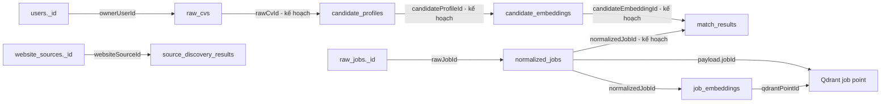

# Data storage

## Tổng quan

AutoJob sử dụng ba hệ thống lưu trữ với trách nhiệm khác nhau:

```text
MongoDB → dữ liệu nghiệp vụ và trạng thái pipeline
Qdrant  → job vector phục vụ semantic search
MinIO   → file CV gốc
```

MongoDB là source of truth cho job, CV metadata và trạng thái xử lý.

Qdrant không chứa full job document. MinIO không chứa candidate profile hoặc business metadata.

## Trạng thái storage hiện tại

| Storage                      | Trạng thái                 |
| ---------------------------- | -------------------------- |
| MongoDB collections cho auth | Đã tích hợp                |
| `raw_jobs`                   | Đã tích hợp                |
| `normalized_jobs`            | Đã tích hợp                |
| `job_embeddings`             | Đã tích hợp                |
| `raw_cvs`                    | Đã tích hợp                |
| Source Discovery collections | Đã tích hợp ở mức skeleton |
| Qdrant `job_vectors_v1`      | Đã tích hợp                |
| MinIO bucket CV              | Đã tích hợp                |
| `candidate_profiles`         | Chưa triển khai            |
| `candidate_embeddings`       | Chưa triển khai            |
| `match_results`              | Chưa triển khai            |
| `crawler_sources`            | Chưa triển khai            |

## MongoDB

Database local:

```text
autojob
```

Connection mặc định:

```text
Host: localhost
Port: 27018
Authentication database: admin
```

Spring Boot đang bật:

```text
spring.data.mongodb.auto-index-creation=true
```

Các index khai báo bằng Spring Data annotation được tự động tạo khi application khởi động.

## `users`

Trạng thái: **Đã tích hợp.**

Mục đích:

* Lưu tài khoản người dùng.
* Lưu BCrypt password hash.
* Lưu role và account status.
* Theo dõi thời điểm tạo và đăng nhập gần nhất.

Unique index:

```text
emailNormalized
```

Index name:

```text
uk_users_email_normalized
```

Backend giữ cả:

```text
email
emailNormalized
```

`emailNormalized` được dùng để đảm bảo email không trùng theo cách normalize của auth module.

Password hash không được trả ra API.

## `refresh_tokens`

Trạng thái: **Đã tích hợp.**

Mục đích:

* Lưu refresh-token session.
* Hỗ trợ token rotation.
* Theo dõi token family.
* Revoke token khi logout hoặc phát hiện reuse.

Raw refresh token không được lưu. Backend chỉ lưu:

```text
tokenHash = SHA-256(refreshToken)
```

Index quan trọng:

| Index               | Loại     |
| ------------------- | -------- |
| `tokenHash`         | Unique   |
| `userId + status`   | Compound |
| `familyId + status` | Compound |
| `expiresAt`         | TTL      |

MongoDB tự xóa session sau khi `expiresAt` đã qua.

## `raw_jobs`

Trạng thái: **Đã tích hợp.**

Mục đích:

* Lưu dữ liệu gần với nguồn crawler.
* Giữ source metadata.
* Theo dõi lần đầu và lần cuối nhìn thấy job.
* Là đầu vào của Job Normalizer.

Liên kết chính:

```text
raw_jobs._id
→ normalized_jobs.rawJobId
```

Unique index:

```text
fingerprint
```

Các index khác:

```text
sourceCode + sourceJobId
sourceCode + collectedAt descending
expiresAt TTL
```

Fingerprint dùng để chống duplicate:

```text
sourceCode + sourceJobId
```

hoặc fallback dựa trên URL, title và company.

### TTL

`expiresAt` được tính một lần khi insert:

```text
expiresAt = firstSeenAt + rawRetentionDays
```

Crawler nhìn thấy lại job không làm mới `expiresAt`.

Với cấu hình local:

```text
rawRetentionDays = 30
```

document có thể bị MongoDB xóa sau 30 ngày tính từ lần đầu xuất hiện.

`normalized_jobs` không tự động bị xóa cùng `raw_jobs`. Vì vậy `normalized_jobs.rawJobId` có thể trỏ đến một raw job đã hết TTL.

### Raw payload

Các field:

```text
rawHtml
rawText
```

chỉ dùng cho debug hoặc dữ liệu tạm.

Sau khi normalization thành công, backend thực hiện `$unset` hai field và cập nhật:

```text
rawPayloadPurgedAt
```

Document `raw_jobs` vẫn được giữ đến khi TTL hết hạn.

## `normalized_jobs`

Trạng thái: **Đã tích hợp.**

Mục đích:

* Lưu job đã normalize.
* Là dữ liệu nghiệp vụ dùng để hiển thị.
* Là đầu vào của job embedding.
* Sau này là dữ liệu Matching Engine load sau Qdrant search.

Liên kết:

```text
normalized_jobs.rawJobId
→ raw_jobs._id
```

Unique key:

```text
rawJobId + normalizationVersion
```

Index name:

```text
uk_raw_job_normalization_version
```

Các index khác:

```text
sourceCode + normalizationVersion
normalizedAt descending
```

Metadata quan trọng:

```text
sourceFingerprint
rawContentHash
normalizationVersion
normalizedAt
```

`rawContentHash` giúp phân biệt:

* Raw job thật sự thay đổi.
* Crawler chỉ cập nhật `lastSeenAt` hoặc `collectedAt`.
* Cần chạy lại embedding hay không.

Version mặc định:

```text
normalizationVersion = rule-v1
```

Một raw job có thể có nhiều normalized document nếu chạy bằng các `normalizationVersion` khác nhau.

Hiện API chủ yếu đọc version hiện tại theo dữ liệu đã tạo; chưa có cơ chế active-version registry riêng.

## `job_embeddings`

Trạng thái: **Đã tích hợp.**

Mục đích:

* Lưu metadata của quá trình embedding.
* Theo dõi trạng thái xử lý.
* Liên kết normalized job với Qdrant point.
* Lưu lỗi để có thể rebuild.

Collection không lưu vector.

Liên kết:

```text
job_embeddings.normalizedJobId
→ normalized_jobs._id
```

Unique key:

```text
normalizedJobId + embeddingVersion
```

Index name:

```text
uk_job_embedding_job_version
```

Các index khác:

```text
status + updatedAt descending
normalizedJobId + updatedAt descending
```

Trạng thái:

```text
PROCESSING
READY
FAILED
```

Metadata quan trọng:

```text
normalizationVersion
modelName
modelRevision
embeddingVersion
textHash
dimension
normalized
qdrantCollection
qdrantPointId
lastError
```

Một normalized job có thể có nhiều metadata record khi embedding model hoặc preprocessing version thay đổi.

Vector tương ứng nằm trong Qdrant, không nằm trong MongoDB.

## `raw_cvs`

Trạng thái: **Đã tích hợp.**

Mục đích:

* Lưu metadata CV upload.
* Liên kết người dùng với file trong MinIO.
* Theo dõi trạng thái CV pipeline.

ID được Java backend tạo bằng UUID:

```text
rawCvId = UUID
```

Liên kết storage:

```text
raw_cvs.bucket
raw_cvs.objectKey
→ MinIO object
```

Liên kết user:

```text
raw_cvs.ownerUserId
→ users._id
```

`ownerUserId` có thể là `null` khi public mode và request không có JWT.

Index:

```text
ownerUserId + uploadedAt descending
sha256
```

Index `sha256` không unique. Upload cùng một file nhiều lần vẫn tạo nhiều document và MinIO object.

Status được khai báo:

```text
UPLOADED
PARSING
PARSED
FAILED
```

Source code hiện mới sử dụng trạng thái:

```text
UPLOADED
```

Chưa có service cập nhật parsing status.

## `website_sources`

Trạng thái: **Đã tích hợp ở mức Source Discovery skeleton.**

Mục đích:

* Lưu website hoặc domain cần discovery.
* Theo dõi trạng thái discovery.

Status:

```text
PENDING_DISCOVERY
DISCOVERING
DISCOVERED
NO_CANDIDATE_FOUND
FAILED
```

Liên kết:

```text
website_sources._id
→ source_discovery_results.websiteSourceId
```

Source code hiện chưa khai báo explicit unique index cho:

```text
sourceCode
domain
```

Do đó có thể tạo nhiều website source trùng domain.

## `source_discovery_results`

Trạng thái: **Đã tích hợp ở mức skeleton.**

Mục đích:

* Lưu candidate career hoặc job URL.
* Ghi detection type.
* Chuẩn bị cho bước admin review.

Status:

```text
PENDING_REVIEW
APPROVED
REJECTED
```

Implementation hiện chỉ tạo:

```text
PENDING_REVIEW
```

Detection type hiện tại:

```text
COMMON_PATH
```

Source code chưa khai báo unique index trên:

```text
websiteSourceId + candidateUrl
```

Chạy discovery nhiều lần cho cùng website source có thể tạo result trùng nhau.

Chưa có persistence cho source đã approve thành `crawler_sources`.

## Collections chưa triển khai

### `candidate_profiles`

**Kế hoạch**

Dùng để lưu kết quả parse CV đã được Java backend validate.

Liên kết đề xuất:

```text
candidate_profiles.rawCvId
→ raw_cvs._id
```

Logical unique key:

```text
rawCvId + parserVersion
```

Các field quan trọng ở mức tổng quan:

```text
identity và contact
skills
experienceYears
seniority
preferredLocations
rawText
embeddingText
parserVersion
createdAt
```

Python parser hiện trả profile response nhưng Java chưa lưu collection này.

### `candidate_embeddings`

**Kế hoạch**

Dùng để lưu metadata candidate embedding.

Liên kết đề xuất:

```text
candidate_embeddings.candidateProfileId
→ candidate_profiles._id
```

Unique key đề xuất:

```text
candidateProfileId + embeddingVersion
```

Vector candidate có thể chỉ được dùng trực tiếp để search job hoặc lưu vào một collection riêng nếu cần reuse. Repository hiện chưa chốt hoặc triển khai candidate Qdrant collection.

### `match_results`

**Kế hoạch**

Dùng để lưu kết quả hybrid ranking.

Liên kết đề xuất:

```text
candidateProfileId
candidateEmbeddingId
normalizedJobId
```

Nên lưu:

```text
rankingVersion
embeddingVersion
rank
finalScore
component scores
explanation evidence
generatedAt
```

Collection này chưa có model hoặc repository.

### `crawler_sources`

**Kế hoạch**

Dùng để lưu source đã được admin approve và crawler có thể chạy.

Nên liên kết với:

```text
website_sources
source_discovery_results
```

Source Discovery hiện chưa tạo collection này.

## Quan hệ ID



Các liên kết này được lưu dưới dạng string trong document. MongoDB không enforce foreign key.

Consistency được application quản lý.

## Version và hash

Các version quan trọng:

| Giá trị                | Vai trò                                         | Trạng thái                                       |
| ---------------------- | ----------------------------------------------- | ------------------------------------------------ |
| `normalizationVersion` | Version rule chuẩn hóa job                      | Đã dùng                                          |
| `embeddingVersion`     | Model, revision, preprocessing và normalization | Đã dùng                                          |
| `parserVersion`        | Version CV parser                               | Có trong Python response, chưa persist bằng Java |
| `rankingVersion`       | Version scoring formula                         | Kế hoạch                                         |

Các hash:

| Hash                             | Mục đích                                |
| -------------------------------- | --------------------------------------- |
| `raw_jobs.fingerprint`           | Chống duplicate job                     |
| `normalized_jobs.rawContentHash` | Phát hiện raw business content thay đổi |
| `job_embeddings.textHash`        | Xác nhận text gửi embedding service     |
| `raw_cvs.sha256`                 | Nhận diện nội dung file CV              |

Các hash có mục đích khác nhau và không nên dùng thay thế lẫn nhau.

## Qdrant

### Collection

Collection hiện tại:

```text
job_vectors_v1
```

Cấu hình:

```text
Vector size: 384
Distance: Cosine
Vector type: unnamed vector
```

Collection được tạo lazy khi job embedding đầu tiên chạy.

Docker Compose không pre-create collection.

Nếu collection đã tồn tại nhưng dimension hoặc distance không khớp cấu hình, Java backend trả lỗi thay vì tự thay đổi schema.

### Point ID

Point ID là UUID v5 deterministic được tạo từ:

```text
normalizedJobId + ":" + embeddingVersion
```

Cùng một normalized job và embedding version luôn tạo cùng point ID.

Rebuild sẽ upsert vào point hiện có thay vì tạo một point mới.

### Payload

Payload hiện tại:

```json
{
  "jobId": "<normalizedJobId>",
  "sourceCode": "MOCK",
  "normalizationVersion": "rule-v1",
  "embeddingVersion": "...",
  "textHash": "..."
}
```

`jobId` là ID của `normalized_jobs`, không phải ID của `raw_jobs`.

Qdrant không lưu:

* Full title hoặc company.
* Full description.
* Requirements và benefits.
* Salary.
* Apply URL.
* Candidate profile.
* Business ranking result.

Sau vector search, Matching Engine phải load job từ MongoDB.

### Persistence

Docker volume:

```text
qdrant_data
```

Reset bằng:

```bash
docker compose --env-file .env down -v
```

sẽ xóa toàn bộ collection và point local.

## MinIO

### Bucket

Bucket mặc định:

```text
autojob-cvs
```

Bucket được tạo bởi:

* `minio-init` trong Docker Compose.
* Java application startup check.

Bucket được cấu hình private:

```text
anonymous access = none
```

Backend hiện không expose presigned download URL.

### Object key

CV được lưu theo pattern:

```text
raw/yyyy/MM/dd/{rawCvId}/{safeFilename}
```

Ví dụ:

```text
raw/2026/08/02/2f3f7f45-c011-4a86-8f4d-bcf3eca99af2/sample-cv.pdf
```

Ngày trong object key dùng UTC.

Thông tin liên kết nằm trong `raw_cvs`:

```text
bucket
objectKey
```

CV parser có code đọc MinIO object bằng hai giá trị này, nhưng Java backend chưa gọi parser.

### File consistency

Upload flow:

```text
upload MinIO
→ save raw_cvs
```

Nếu save MongoDB thất bại, Java cố gắng xóa MinIO object.

Đây là best-effort compensation, không phải distributed transaction.

Repository hiện chưa có:

* API xóa CV.
* Scheduled cleanup object mồ côi.
* File versioning.
* Deduplication dựa trên SHA-256.
* Retention policy cho CV.

### Persistence

Docker volume:

```text
minio_data
```

Xóa Docker volume sẽ xóa toàn bộ CV local.

## Kiểm tra storage nhanh

### MongoDB collections

```bash
docker compose --env-file .env exec mongo \
  mongosh \
  -u root \
  -p password \
  --authenticationDatabase admin \
  autojob \
  --eval 'db.getCollectionNames().sort()'
```

Đếm document:

```bash
docker compose --env-file .env exec mongo \
  mongosh \
  -u root \
  -p password \
  --authenticationDatabase admin \
  autojob \
  --eval '
    printjson({
      rawJobs: db.raw_jobs.countDocuments(),
      normalizedJobs: db.normalized_jobs.countDocuments(),
      jobEmbeddings: db.job_embeddings.countDocuments(),
      rawCvs: db.raw_cvs.countDocuments()
    })
  '
```

Xem index:

```bash
docker compose --env-file .env exec mongo \
  mongosh \
  -u root \
  -p password \
  --authenticationDatabase admin \
  autojob \
  --eval 'db.raw_jobs.getIndexes()'
```

### Qdrant

```bash
curl -s \
  http://localhost:6333/collections/job_vectors_v1 \
  | jq
```

### MinIO

Mở:

```text
http://localhost:9001
```

Đăng nhập bằng credentials trong `.env`, sau đó kiểm tra bucket:

```text
autojob-cvs
```

## Giới hạn lifecycle hiện tại

Các thao tác xóa chưa được nối end-to-end.

Hiện chưa có logic tự động:

* Xóa Qdrant point khi normalized job bị xóa.
* Xóa normalized job khi raw job hết TTL.
* Xóa `job_embeddings` khi Qdrant point bị xóa.
* Xóa MinIO object khi user xóa CV.
* Xóa source discovery result trùng.
* Cascade delete giữa các collection.

Khi bổ sung delete hoặc retention, cần xử lý MongoDB, Qdrant và MinIO theo cùng một workflow có retry và reconciliation.
